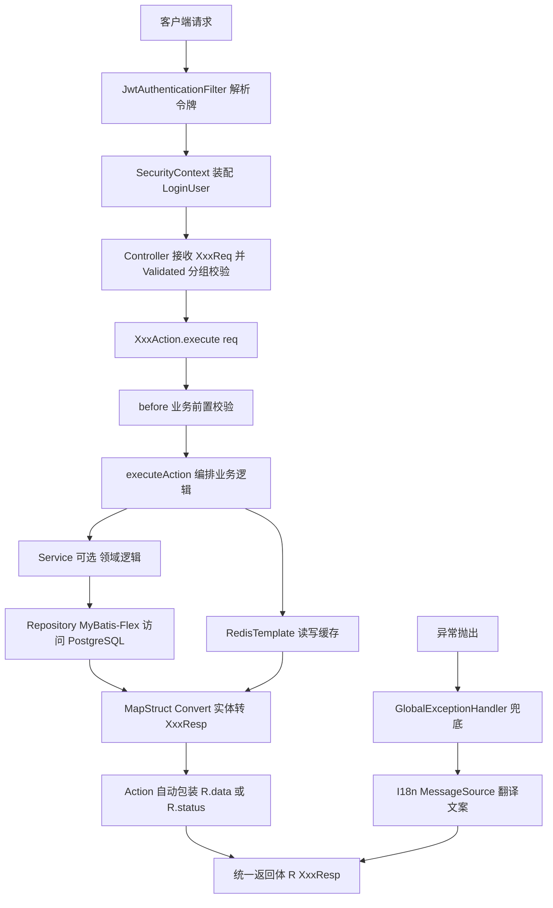

## 产品概述

在 `04后端工程/ace-backend`（当前空目录）从零构建一个可直接启动的企业级 Java 后端骨架工程，作为公司后台管理系统的服务端基座。工程以 Spring Boot 4.1.1 为核心，整合 MyBatis-Flex + PostgreSQL、Redis、Spring Security 7.1 + JWT、MapStruct + Lombok、Hutool，并确立一套贯穿全工程的编码范式：**一接口一 Action 类 + Req/Resp 命名 + Repository 层命名**。

## 核心特性

- **工程基座**：Maven 单模块工程，JDK 23.0.2 编译目标，本机 Maven 3.9.12 构建，多环境 profile（dev/test/prod），Windows 与 Linux 启动脚本，日志含 MDC 链路追踪 ID
- **Action 编排范式**：每个 API 对应一个 `AbstractActionTemplate` 实现类（`#{业务名称}Action`），模板统一封装 `before` → `executeAction` 流程并自动包装为统一返回体，一个类只干一件事
- **DTO 规范**：Controller 入参出参统一 `#{业务名称}Req` / `#{业务名称}Resp` 后缀，实体与 DTO 之间由 MapStruct 编译期转换
- **数据访问**：MyBatis-Flex（Boot 4 专用 starter）接入 PostgreSQL，数据层包名与类名统一为 `repository`（`XxxRepository extends BaseMapper<XxxEntity>`），内置分页、逻辑删除、乐观锁、数据自动填充
- **缓存能力**：Redis 接入，String + JSON 序列化，禁用 JDK 原生序列化
- **认证授权**：Spring Security 7.1 无状态鉴权，Nimbus JWT 签发校验，白名单放行，401/403 统一处理，方法级 `@PreAuthorize` 生效，RBAC 五表结构与实体映射骨架
- **接口规范**：统一返回体 `R<T>`（提供泛型静态工厂以适配 Action 模板）、业务与系统异常体系、全局异常兜底、`@Valid` 分组校验 + 国际化错误文案
- **接口文档**：以 Javadoc 注释为零侵入主方案（Apifox IDEA 插件识别），辅以 SpringDoc 生成 `/v3/api-docs` 供 Apifox URL 导入，生产环境关闭

## 技术栈选型

| 组件 | 选型 | 版本（已核实 Maven Central / 官方文档） |
| --- | --- | --- |
| 构建 | Maven 单模块 | 本机 **3.9.12**（`D:\apache-maven-3.9.12`） |
| JDK | Oracle JDK | **23.0.2**（`release=23`，不得高于已安装版本） |
| 框架 | Spring Boot | **4.1.1**（2026-08-20 发布，要求 JDK 17+，兼容至 JDK 26） |
| Web | spring-boot-starter-web | 坐标不变，Boot 4.1.1 下存在 |
| ORM | `com.mybatis-flex:mybatis-flex-spring-boot4-starter` | **1.11.8**（2026-07-01） |
| APT | `com.mybatis-flex:mybatis-flex-processor` | 1.11.8 |
| 数据库 | PostgreSQL | 驱动交由 Boot BOM 管理，不写版本 |
| 缓存 | spring-boot-starter-data-redis | 坐标不变，Boot 4.1.1 下存在 |
| 安全 | spring-boot-starter-security + spring-boot-starter-oauth2-resource-server | 由 Boot BOM 管理，实得 **Spring Security 7.1.0** |
| JWT | Nimbus JOSE（随 oauth2-resource-server 引入） | 由 Boot BOM 管理 |
| 对象转换 | org.mapstruct:mapstruct + mapstruct-processor | **1.6.3**（1.7.0 仍为 Beta2，不用） |
| 简化代码 | org.projectlombok:lombok | **1.18.46**（覆盖 JDK 23/25/26） |
| 处理器桥接 | org.projectlombok:lombok-mapstruct-binding | 0.2.0 |
| 工具包 | cn.hutool:hutool-bom | 取最新稳定版 |
| 接口文档 | org.springdoc:springdoc-openapi-starter-webmvc-api | **3.1.0**（2026-08-01，Boot 4 线） |


### 关键决策与理由

1. **MyBatis-Flex 必须用 Boot 4 专用 starter**：`mybatis-flex-spring-boot4-starter`；通用的 `mybatis-flex-spring-boot-starter` 属 Boot 3 线，混用会导致自动配置失效。
2. **JWT 用 Nimbus JOSE 而非 jjwt**：`jjwt-jackson` 强依赖 Jackson 2，而 Boot 4 默认已是 Jackson 3，引入 jjwt 会直接触发依赖冲突；Nimbus 随 Security 的 oauth2-resource-server 一并引入，零额外依赖。
3. **springdoc 用 3.x**：已验证 3.1.0 的 pom 依赖 Boot 4 新增的 `spring-boot-webmvc`、`spring-boot-web-server` 模块；2.8.17 属 Boot 3 线。
4. **单模块优先**：Boot 4 + JDK 23 + Jackson 3 组合破坏性变更多，单模块可将依赖冲突与 APT 问题排查成本降到最低；包结构已按分层与业务模块内聚预留，后续按领域拆模块成本低。
5. **编译目标 23**：本机即 JDK 23.0.2，`release` 不得高于已安装 JDK；README 注明升级 JDK 25 后只需改一个属性。
6. **Action 与 Service 的边界**：Controller 极薄只做转发；**Action 为 application 层，一接口一类，负责编排与事务边界**；Service 为 domain 层，仅放跨 Action 复用的领域逻辑；简单查询类 Action 可直接调 Repository，不强制套 Service。

## 实现方案

请求链路（含新增的 Action 编排层）：



要点说明：

- **注解处理器链是编译成败的命门**：本机正是 JDK 23.0.2，而自 JDK 23 起 javac 默认等同 `-proc:none`，不再自动扫描 classpath 上的注解处理器。Lombok、MapStruct、MyBatis-Flex 的 APT 会**静默失效**（表现为大量 `cannot find symbol`），必须在 maven-compiler-plugin 中显式声明 `annotationProcessorPaths` 并开启 `<proc>full</proc>`。
- **Jackson 3 兼容需先验证再定稿**：Boot 4 默认 Jackson 3（包名 `tools.jackson.*`），而 Hutool、部分三方库仍依赖 Jackson 2。实施时先做最小验证（Hutool JSON / Redis 序列化 / 统一返回体序列化），再决定沿用或降级共存，结论与开关写入 README。
- **Apifox 双通道**：主通道为 Javadoc 注释 + Apifox IDEA 插件，零运行时依赖、零注解侵入，规避 `therapi-runtime-javadoc`（最新版仍停在 2022 年的 0.15.0）在高版本 JDK 上的兼容风险；辅通道为 springdoc 暴露 `/v3/api-docs`，prod 默认关闭。
- **Repository 改名落地**：`@MapperScan` 指向 `com.gm.ace.**.repository`，接口 `XxxRepository extends BaseMapper<XxxEntity>`，XML 与 TableDef 一并遵循小写下划线命名。

## 实施注意事项

- **注解处理器顺序不可调换**：lombok → lombok-mapstruct-binding → mapstruct-processor → mybatis-flex-processor；Lombok 依赖声明为 `provided`。
- **APT 生效必须确证**：编译后检查 `target/generated-sources` 下是否生成 `*MapperImpl`（MapStruct）与 MyBatis-Flex TableDef 产物，**仅"编译通过"不足以证明 APT 生效**。
- **`R` 必须提供泛型静态工厂**：用户给定的模板中 `return R.status((Boolean) response);` 要求 `R.status` 能返回 `R<Response>`，若 `status` 返回 `R<Boolean>` 则编译期类型不兼容，这是模板能否落地的硬门槛。
- **`execute()` 无参场景**：`Request` 泛型可空，约定无入参接口使用 `EmptyReq` 空对象而非裸 `null`，并在 Javadoc 中写明，避免子类误用。
- **事务边界**：模板本身不加事务（避免长事务），由子类 `executeAction` 按需标注 `@Transactional`。
- **Redis 序列化**：禁用 JDK 原生序列化，统一 String + JSON，保证 redis-cli 可读、跨语言可解析，规避反序列化安全风险。
- **PostgreSQL 规范**：表名与字段名统一小写加下划线；显式指定分页方言与主键策略；jsonb 字段注册类型处理器。
- **国际化**：`spring.messages.basename` 指向 i18n 目录，校验注解 message 统一使用占位符键，由全局异常处理器经 MessageSource 翻译后返回，杜绝 DTO 中硬编码中文。
- **安全边界**：JWT 密钥从配置项读取、禁止硬编码；密码使用强哈希；白名单仅放行登录、健康检查、文档等必要路径；`MethodArgumentNotValidException` 的返回体不得回显敏感字段值。
- **影响面控制**：对象存储、Excel 导入导出、限流与可观测性本次不实现，仅预留包结构位置，不引入依赖、不写实现。

## 架构设计

四层分层 + Action 编排层，包结构按职责内聚：

- **common 层**：统一返回体与返回码、分页封装、`AbstractActionTemplate` 业务模板、实体基类、异常体系、校验分组、链路追踪
- **config 层**：MyBatis-Flex、Redis、Security、SpringDoc、国际化、Jackson 兼容配置
- **security 层**：令牌签发与校验、认证过滤器、登录用户模型、未认证与未授权处理器
- **module 层**：按业务模块划分，模块内 `controller / action / service / repository / entity / dto.req / dto.resp / convert` 自成一格

## 目录结构

```
d:/gm-workspace/gm-company/04后端工程/ace-backend/
├── pom.xml                                    # [NEW] 单模块工程自身即父 POM。定义 Boot 4.1.1 parent、版本属性（java.version=23）、依赖清单；核心是 maven-compiler-plugin 的 release=23、proc=full 与 annotationProcessorPaths 四段处理器链。
├── README.md                                  # [NEW] 启动步骤、JDK23/Maven3.9.12 环境要求、版本矩阵、Jackson 3 风险与降级说明、Apifox 双通道用法、Action/Req/Resp/Repository 编码规范、已知风险清单。
├── db/
│   └── schema.sql                             # [NEW] RBAC 五表 DDL：sys_user、sys_role、sys_menu、sys_user_role、sys_role_menu。小写下划线命名，含逻辑删除与乐观锁字段、注释与索引。
├── script/
│   ├── start.sh                               # [NEW] Linux 启动脚本，支持 start/stop/restart/status，含 JVM 参数与 profile 传参。
│   └── start.bat                              # [NEW] Windows 启动脚本，功能同上，适配本机环境。
└── src/main/
    ├── java/com/gm/ace/
    │   ├── AceBackendApplication.java         # [NEW] 启动类，配置 @MapperScan 指向 **.repository 包。
    │   ├── common/
    │   │   ├── result/R.java                  # [NEW] 统一返回体。承载 code/message/data/timestamp/traceId；必须提供泛型静态工厂 data/status/ok/fail，以适配 Action 模板的 R<Response> 返回。
    │   │   ├── result/PageResult.java         # [NEW] 分页返回封装，与 MyBatis-Flex Page 对接。
    │   │   ├── result/ResultCode.java         # [NEW] 返回码枚举：成功、业务失败、参数错误、未认证、未授权、系统异常。
    │   │   ├── action/AbstractActionTemplate.java # [NEW] 业务抽象模板（用户提供骨架）。保留 before/executeAction/execute(req)/execute() 签名，修正泛型不兼容，增强 after 钩子与模式匹配写法。
    │   │   ├── base/BaseEntity.java           # [NEW] 实体基类：主键、创建/更新人与时间、逻辑删除、乐观锁版本号。
    │   │   ├── exception/BizException.java    # [NEW] 业务异常，携带返回码。
    │   │   ├── exception/SystemException.java # [NEW] 系统异常，日志记全量栈，响应仅返回泛化提示。
    │   │   ├── exception/GlobalExceptionHandler.java # [NEW] 全局兜底：参数校验、业务异常、系统异常、未认证、未授权、404、方法不支持，统一经 MessageSource 翻译后包装为 R。
    │   │   ├── validate/AddGroup.java         # [NEW] 新增分组校验标识。
    │   │   ├── validate/UpdateGroup.java      # [NEW] 更新分组校验标识。
    │   │   ├── validate/EmptyReq.java         # [NEW] 无入参接口的约定 Req 类型，避免 execute() 传裸 null。
    │   │   └── trace/TraceIdFilter.java       # [NEW] 生成 traceId 写入 MDC，透传至响应头，并注入 R 的 traceId 字段。
    │   ├── config/
    │   │   ├── MybatisFlexConfig.java         # [NEW] 分页方言、逻辑删除、乐观锁、数据填充、PostgreSQL 主键策略配置。
    │   │   ├── RedisConfig.java               # [NEW] RedisTemplate 序列化配置（String + JSON，禁用 JDK 原生序列化）。
    │   │   ├── SecurityConfig.java            # [NEW] 无状态会话、白名单、过滤器链、密码编码器、开启方法级鉴权。
    │   │   ├── OpenApiConfig.java             # [NEW] SpringDoc 元信息与 Bearer 安全方案，prod 默认关闭。
    │   │   ├── MessageSourceConfig.java       # [NEW] 国际化资源与校验消息源打通。
    │   │   └── JacksonCompatConfig.java       # [NEW] Jackson 3 兼容适配，按验证结论决定沿用或降级，结论写入 README。
    │   ├── security/
    │   │   ├── JwtProperties.java             # [NEW] 令牌配置项，密钥与有效期从配置读取，禁止硬编码。
    │   │   ├── JwtTokenService.java           # [NEW] 基于 Nimbus 的签发、解析与校验。
    │   │   ├── JwtAuthenticationFilter.java   # [NEW] 解析请求头令牌，装配认证信息到安全上下文。
    │   │   ├── LoginUser.java                 # [NEW] 登录用户模型，承载用户标识、角色与权限集合。
    │   │   └── handler/                       # [NEW] 未认证与未授权处理器，返回统一返回体 R。
    │   └── module/system/                     # [NEW] RBAC 预留模块，完整示范工程范式，不实现全套业务 CRUD。
    │       ├── controller/SysUserController.java  # [NEW] 极薄控制器：接收 XxxReq + @Validated 分组，一行转发给对应 Action。
    │       ├── action/UserPageAction.java     # [NEW] Action 范式示范（分页查询），extends AbstractActionTemplate<UserPageReq, PageResult<UserPageResp>>。
    │       ├── action/UserDetailAction.java   # [NEW] Action 范式示范（单条查询），示范 @PreAuthorize 鉴权与 Repository 直调。
    │       ├── service/SysUserService.java    # [NEW] 领域服务骨架，示范跨 Action 复用逻辑的落点。
    │       ├── repository/SysUserRepository.java # [NEW] 数据层（原 mapper 层改名），extends BaseMapper<SysUser>。
    │       ├── entity/SysUser.java            # [NEW] 用户实体，映射 sys_user 表，继承 BaseEntity。
    │       ├── entity/SysRole.java            # [NEW] 角色实体骨架。
    │       ├── entity/SysMenu.java            # [NEW] 菜单实体骨架。
    │       ├── dto/req/UserPageReq.java       # [NEW] 入参 DTO，字段带 Javadoc（供 Apifox 解析），校验注解使用国际化占位符键。
    │       ├── dto/req/UserDetailReq.java     # [NEW] 入参 DTO。
    │       ├── dto/resp/UserPageResp.java     # [NEW] 出参 DTO，字段带 Javadoc。
    │       ├── dto/resp/UserDetailResp.java   # [NEW] 出参 DTO。
    │       └── convert/SysUserConvert.java    # [NEW] MapStruct 转换器（@Mapper(componentModel = "spring")），验证 APT 生效，实体转 Resp。
    └── resources/
        ├── application.yml                    # [NEW] 主配置，公共项与 profile 激活。
        ├── application-dev.yml                # [NEW] 开发环境：数据源、Redis、日志级别、SpringDoc 开启。
        ├── application-test.yml               # [NEW] 测试环境配置。
        ├── application-prod.yml               # [NEW] 生产环境配置：SpringDoc 关闭、日志降级、敏感项外置。
        ├── i18n/messages.properties           # [NEW] 默认国际化资源。
        ├── i18n/messages_zh_CN.properties     # [NEW] 中文资源，含校验与异常文案。
        ├── i18n/messages_en_US.properties     # [NEW] 英文资源。
        └── logback-spring.xml                 # [NEW] 日志配置，按 profile 区分，控制台输出含 MDC traceId。
```

## 关键代码结构

**1. 统一返回体的泛型静态工厂（Action 模板能否编译通过的前提）**

```java
public final class R<T> implements Serializable {
    private int code;
    private String message;
    private T data;
    private long timestamp;
    private String traceId;

    /** 泛型静态工厂：返回 R<T> 而非 R<Boolean>，否则 AbstractActionTemplate 中 R.status(...) 无法赋值给 R<Response> */
    public static <T> R<T> data(T data);
    public static <T> R<T> status(boolean success);
    public static <T> R<T> ok();
    public static <T> R<T> fail(ResultCode resultCode);
    public static <T> R<T> fail(ResultCode resultCode, String message);
}
```

**2. 业务抽象模板（保留用户给定签名，做兼容性修正与最小增强）**

```java
/**
 * 业务抽象模板，子类实现execute即可，一个类干一件事
 *
 * @author guoym
 * @param <Request>  入参类型，约定为 #{业务名称}Req；无入参场景使用 EmptyReq
 * @param <Response> 出参类型，约定为 #{业务名称}Resp
 */
public abstract class AbstractActionTemplate<Request, Response> {

    protected void before(Request request) {}

    /** 业务编排主体，由子类按需标注 @Transactional 控制事务边界 */
    protected abstract Response executeAction(Request request);

    /** 后置钩子，用于埋点、操作日志、后置缓存，默认空实现 */
    protected void after(Request request, Response response) {}

    public R<Response> execute(Request request) {
        before(request);
        Response response = executeAction(request);
        after(request, response);
        // JDK 16+ 模式匹配；response 为 null 时走 R.data(null)，语义为成功但无数据
        if (response instanceof Boolean bool) {
            return R.status(bool);
        }
        return R.data(response);
    }

    /** 无入参场景：约定 Request 为 EmptyReq，禁止直接传裸 null */
    public R<Response> execute() {
        return execute(null);
    }
}
```

**3. Action 范式与 Controller 一行转发（全工程统一遵循）**

```java
/**
 * 分页查询用户列表
 */
@Component
public class UserPageAction extends AbstractActionTemplate<UserPageReq, PageResult<UserPageResp>> {

    @Resource
    private SysUserRepository sysUserRepository;

    @Override
    protected PageResult<UserPageResp> executeAction(UserPageReq req) {
        Page<SysUser> page = sysUserRepository.paginate(Page.of(req.getPageNum(), req.getPageSize()),
                QueryWrapper.create().like(SysUser::getUserName, req.getKeyword()));
        return PageResult.of(page, SysUserConvert.INSTANCE::toPageResp);
    }
}

/**
 * 用户管理
 */
@RestController
@RequestMapping("/system/user")
public class SysUserController {

    @Resource
    private UserPageAction userPageAction;

    /**
     * 分页查询用户列表
     *
     * @param req 查询条件，keyword 为用户名模糊匹配，pageNum/pageSize 为分页参数
     * @return 用户分页数据
     */
    @GetMapping("/page")
    @PreAuthorize("hasAuthority('system:user:list')")
    public R<PageResult<UserPageResp>> page(@Validated UserPageReq req) {
        return userPageAction.execute(req);
    }
}
```

**4. 编译插件的注解处理器链（顺序不可调换，JDK 23 下 APT 生效的唯一保障）**

```xml
<plugin>
    <groupId>org.apache.maven.plugins</groupId>
    <artifactId>maven-compiler-plugin</artifactId>
    <configuration>
        <release>23</release>
        <proc>full</proc>
        <annotationProcessorPaths>
            <path>
                <groupId>org.projectlombok</groupId>
                <artifactId>lombok</artifactId>
                <version>1.18.46</version>
            </path>
            <path>
                <groupId>org.projectlombok</groupId>
                <artifactId>lombok-mapstruct-binding</artifactId>
                <version>0.2.0</version>
            </path>
            <path>
                <groupId>org.mapstruct</groupId>
                <artifactId>mapstruct-processor</artifactId>
                <version>1.6.3</version>
            </path>
            <path>
                <groupId>com.mybatis-flex</groupId>
                <artifactId>mybatis-flex-processor</artifactId>
                <version>1.11.8</version>
            </path>
        </annotationProcessorPaths>
    </configuration>
</plugin>
```