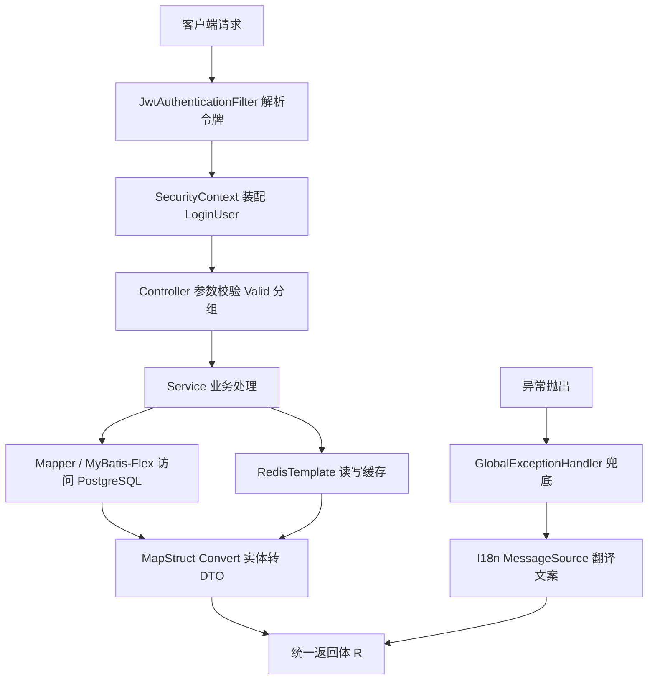

## 产品概述

在 `04后端工程/ace-backend` 空目录中从零构建一个可直接启动的企业级 Java 后端骨架工程，作为公司后台管理系统的服务端基座。工程需整合 Spring Boot 4.1.1、MyBatis-Flex + PostgreSQL、Redis、Spring Security 7.1 + JWT、MapStruct + Lombok、Hutool，并交付统一返回体、全局异常处理、参数校验与国际化、Apifox 可识别的注释式接口文档，按 RBAC 预留权限分层与五张表结构，提供多环境配置与 jar 启动脚本。

## 核心特性

- **工程基座**：Maven 单模块工程，JDK 编译目标可配置（默认 21，支持 23/25），多环境 profile（dev/test/prod），Windows 与 Linux 启动脚本，日志含 MDC 链路追踪 ID
- **数据访问**：MyBatis-Flex（Boot 4 专用 starter）接入 PostgreSQL，内置分页、逻辑删除、乐观锁、数据自动填充，jsonb 字段处理，小写下划线命名规范
- **缓存能力**：Redis 接入，RedisTemplate 使用可读的 String + JSON 序列化，禁用 JDK 原生序列化
- **对象转换**：MapStruct + Lombok 编译期生成 DTO 转换器与实体方法，注解处理器链显式配置
- **认证授权**：Spring Security 7.1 无状态鉴权，JWT 签发与校验，白名单放行，401/403 统一处理，方法级 `@PreAuthorize` 生效，RBAC 五表结构与实体映射骨架
- **接口规范**：统一返回体与业务异常体系，全局异常兜底，`@Valid` 分组校验 + 国际化错误文案
- **接口文档**：以 Javadoc 注释为零侵入主方案（Apifox IDEA 插件识别），辅以 SpringDoc 生成 `/v3/api-docs` 供 Apifox URL 导入，生产环境可关闭

## 技术栈选型

| 组件 | 选型 | 版本（已核实 Maven Central / 官方文档） |
| --- | --- | --- |
| 构建 | Maven（单模块） | wrapper 或本地 mvn |
| 框架 | Spring Boot | **4.1.1**（2026-08-20 发布，要求 JDK 17+，兼容至 JDK 26） |
| Web | spring-boot-starter-web | 坐标不变，Boot 4.1.1 下存在 |
| JDK | 编译目标 | **release 默认 21**（LTS 基线，JDK 21~26 均可编译）；README 注明改为 25 的方法 |
| ORM | `com.mybatis-flex:mybatis-flex-spring-boot4-starter` | **1.11.8**（2026-07-01） |
| 代码生成 | `com.mybatis-flex:mybatis-flex-processor` | 1.11.8 |
| 数据库 | PostgreSQL | 驱动交由 Boot BOM 管理，不写版本 |
| 缓存 | spring-boot-starter-data-redis | 坐标不变，Boot 4.1.1 下存在 |
| 安全 | spring-boot-starter-security + spring-boot-starter-oauth2-resource-server | 由 Boot BOM 管理，实得 **Spring Security 7.1.0** |
| JWT 库 | Nimbus JOSE（随 oauth2-resource-server 引入） | 由 Boot BOM 管理 |
| 对象转换 | org.mapstruct:mapstruct + mapstruct-processor | **1.6.3**（1.7.0 仍为 Beta2，不用） |
| 简化代码 | org.projectlombok:lombok | **1.18.46**（覆盖 JDK 23/25/26） |
| 处理器桥接 | org.projectlombok:lombok-mapstruct-binding | 0.2.0 |
| 工具包 | cn.hutool:hutool-bom | 取最新稳定版 |
| 接口文档 | org.springdoc:springdoc-openapi-starter-webmvc-api | **3.1.0**（2026-08-01，Boot 4 线） |


**关键决策与理由**

1. **MyBatis-Flex 必须用 Boot 4 专用 starter**：`mybatis-flex-spring-boot4-starter`，通用的 `mybatis-flex-spring-boot-starter` 属 Boot 3 线，混用会导致自动配置失效。
2. **JWT 用 Nimbus JOSE 而非 jjwt**：`jjwt-jackson` 强依赖 Jackson 2，而 Boot 4 默认已是 Jackson 3，引入 jjwt 会直接触发依赖冲突；Nimbus 随 Security 的 oauth2-resource-server 一并引入，零额外依赖且与安全框架无缝衔接。
3. **springdoc 用 3.x 而非 2.8.x**：已验证 3.1.0 的 pom 依赖 Boot 4 新增的 `spring-boot-webmvc`、`spring-boot-web-server` 模块，2.8.17 属 Boot 3 线。
4. **单模块优先**：Boot 4 + 高版本 JDK + Jackson 3 的组合本身存在较多破坏性变更，单模块可将依赖冲突与注解处理器问题的排查成本降到最低；后续业务膨胀再按领域拆分模块，包结构已按分层预留。
5. **编译目标 21 而非 25**：JDK 23 是非 LTS 且已停止公开更新；release=21 可在 JDK 21~26 任意版本上编译，团队环境兼容性与 CI 稳定性最优，虚拟线程等核心能力在 21 已 GA；若需 JDK 25 新特性，改一个属性即可。

## 实现方案

分层架构，请求链路为：



要点说明：

- **注解处理器链**：JDK 23+ 起 javac 默认不再自动扫描 classpath 上的注解处理器，必须在 maven-compiler-plugin 中显式声明 `annotationProcessorPaths`，否则 Lombok、MapStruct、MyBatis-Flex 的 APT 全部静默失效，表现为大量 `cannot find symbol`。
- **Jackson 3 兼容**：Boot 4 默认 Jackson 3（包名 `tools.jackson.*`），而 Hutool、部分三方库仍依赖 Jackson 2。实施时需先做最小验证，再决定是沿用 Jackson 3 还是降级/共存，并将结论与开关写入 README。
- **Apifox 双通道**：主通道为 Javadoc 注释 + Apifox IDEA 插件，零运行时依赖、无注解侵入，规避 `therapi-runtime-javadoc`（最新版仍停在 2022 年的 0.15.0）在高版本 JDK 上的兼容风险；辅通道为 springdoc 暴露 `/v3/api-docs`，prod 默认关闭。

## 实施注意事项

- **注解处理器顺序**（决定编译成败）：lombok → lombok-mapstruct-binding → mapstruct-processor → mybatis-flex-processor，且 Lombok 依赖声明为 `provided` 作用域。
- **APT 生效验证**：编译后检查 `target/generated-sources` 下是否生成了 `*MapperImpl`（MapStruct）与 TableDef 产物（MyBatis-Flex），仅"编译通过"不足以证明 APT 生效。
- **Redis 序列化**：禁用 JDK 原生序列化，统一 String + JSON，保证 redis-cli 中可读、跨语言可解析，避免安全反序列化风险。
- **PostgreSQL 规范**：表名与字段名统一小写加下划线；显式指定分页方言与主键策略；jsonb 字段注册类型处理器。
- **国际化**：`spring.messages.basename` 指向 i18n 目录，校验注解的 message 统一使用占位符键，由全局异常处理器经 MessageSource 翻译后返回，杜绝在 DTO 中硬编码中文。
- **安全边界**：JWT 密钥从配置项读取、禁止硬编码，密码使用强哈希；令牌白名单仅放行登录、健康检查、文档等必要路径，其余一律鉴权；`MethodArgumentNotValidException` 的返回体不得回显敏感字段值。
- **影响面控制**：对象存储、Excel 导入导出、限流与可观测性等本次不实现，仅在包结构中预留位置，不引入依赖、不写实现。

## 架构设计

采用经典四层分层，包结构按职责内聚：

- **common 层**：统一返回体、分页封装、基础基类、异常体系、校验分组、工具类边界
- **config 层**：MyBatis-Flex、Redis、Security、SpringDoc、国际化、Jackson 兼容等配置
- **security 层**：令牌签发与校验、认证过滤器、登录用户模型、未认证与未授权处理器
- **module 层**：按业务模块划分，每个模块内 entity / mapper / service / controller / convert 自成一格

## 目录结构

```
d:/gm-workspace/gm-company/04后端工程/ace-backend/
├── pom.xml                                    # [NEW] 父级即工程自身（单模块）。定义 Boot 4.1.1 parent、版本属性、依赖清单，重点配置 maven-compiler-plugin 的 annotationProcessorPaths 与 release。
├── README.md                                  # [NEW] 启动步骤、环境要求、版本矩阵、JDK/Jackson 降级说明、Apifox 双通道使用方式、已知风险清单。
├── db/
│   └── schema.sql                             # [NEW] RBAC 五表 DDL：用户、角色、菜单、用户角色关联、角色菜单关联。小写下划线命名，含逻辑删除与乐观锁字段、注释与索引。
├── script/
│   ├── start.sh                               # [NEW] Linux 启动脚本，支持 start/stop/restart/status，含 JVM 参数与 profile 传参。
│   └── start.bat                              # [NEW] Windows 启动脚本，功能同上。
└── src/main/
    ├── java/com/gm/ace/
    │   ├── AceBackendApplication.java         # [NEW] 启动类。
    │   ├── common/
    │   │   ├── result/R.java                  # [NEW] 统一返回体，承载 code/message/data/timestamp/traceId，提供 ok/fail 静态工厂。
    │   │   ├── result/PageResult.java         # [NEW] 分页返回封装，与 MyBatis-Flex Page 对接。
    │   │   ├── result/ResultCode.java         # [NEW] 返回码枚举，区分成功、业务失败、参数错误、未认证、未授权、系统异常。
    │   │   ├── base/BaseEntity.java           # [NEW] 实体基类，承载主键、创建/更新人与时间、逻辑删除、乐观锁版本号。
    │   │   ├── exception/BizException.java    # [NEW] 业务异常，携带返回码。
    │   │   ├── exception/SystemException.java # [NEW] 系统异常，日志记全量栈，响应仅返回泛化提示。
    │   │   ├── exception/GlobalExceptionHandler.java # [NEW] 全局兜底：参数校验、业务异常、系统异常、未认证、未授权、404、方法不支持，统一经 MessageSource 翻译后包装为 R。
    │   │   ├── validate/AddGroup.java         # [NEW] 新增分组校验标识。
    │   │   ├── validate/UpdateGroup.java      # [NEW] 更新分组校验标识。
    │   │   └── trace/TraceIdFilter.java       # [NEW] 生成 traceId 写入 MDC，并透传至响应头。
    │   ├── config/
    │   │   ├── MybatisFlexConfig.java         # [NEW] 分页、逻辑删除、乐观锁、数据填充、PostgreSQL 方言与主键策略配置。
    │   │   ├── RedisConfig.java               # [NEW] RedisTemplate 序列化配置（String + JSON，禁用 JDK 原生序列化）。
    │   │   ├── SecurityConfig.java            # [NEW] 无状态会话、白名单、过滤器链、密码编码器、开启方法级鉴权。
    │   │   ├── OpenApiConfig.java             # [NEW] SpringDoc 元信息与 Bearer 安全方案，prod 默认关闭。
    │   │   ├── MessageSourceConfig.java       # [NEW] 国际化资源与校验消息源打通。
    │   │   └── JacksonCompatConfig.java       # [NEW] Jackson 3 兼容适配，按验证结论决定沿用或降级，结论写入 README。
    │   ├── security/
    │   │   ├── JwtProperties.java             # [NEW] 令牌配置项，密钥与有效期从配置读取，禁止硬编码。
    │   │   ├── JwtTokenService.java           # [NEW] 基于 Nimbus 的签发、解析与校验，支持刷新与失效判定。
    │   │   ├── JwtAuthenticationFilter.java  # [NEW] 解析请求头令牌，装配认证信息到安全上下文。
    │   │   ├── LoginUser.java                 # [NEW] 登录用户模型，承载用户标识、角色与权限集合。
    │   │   └── handler/                       # [NEW] 未认证与未授权处理器，返回统一返回体。
    │   └── module/system/                     # [NEW] RBAC 预留模块，仅骨架与示例，不实现完整业务 CRUD。
    │       ├── entity/                        # [NEW] 用户、角色、菜单实体，映射五表结构。
    │       ├── mapper/                        # [NEW] 对应 Mapper 接口骨架。
    │       ├── service/                       # [NEW] 服务层骨架（本次不实现完整业务）。
    │       ├── controller/DemoController.java # [NEW] 示例接口，含 Javadoc 注释规范示范与 @PreAuthorize 鉴权示范。
    │       └── convert/                       # [NEW] MapStruct 转换器示例，验证 APT 生效。
    └── resources/
        ├── application.yml                    # [NEW] 主配置，含公共项与 profile 激活。
        ├── application-dev.yml                # [NEW] 开发环境：数据源、Redis、日志级别、SpringDoc 开启。
        ├── application-test.yml               # [NEW] 测试环境配置。
        ├── application-prod.yml               # [NEW] 生产环境配置：SpringDoc 关闭、日志降级、敏感项外置。
        ├── i18n/messages.properties           # [NEW] 默认国际化资源。
        ├── i18n/messages_zh_CN.properties     # [NEW] 中文资源，含校验与异常文案。
        ├── i18n/messages_en_US.properties     # [NEW] 英文资源。
        └── logback-spring.xml                 # [NEW] 日志配置，按 profile 区分，控制台输出含 MDC traceId。
```

## 关键代码结构

**1. 编译插件的注解处理器链（编译成败的关键，顺序不可调换）**

```xml
<plugin>
    <groupId>org.apache.maven.plugins</groupId>
    <artifactId>maven-compiler-plugin</artifactId>
    <configuration>
        <release>${java.version}</release>
        <proc>full</proc>
        <annotationProcessorPaths>
            <path>
                <groupId>org.projectlombok</groupId>
                <artifactId>lombok</artifactId>
                <version>${lombok.version}</version>
            </path>
            <path>
                <groupId>org.projectlombok</groupId>
                <artifactId>lombok-mapstruct-binding</artifactId>
                <version>0.2.0</version>
            </path>
            <path>
                <groupId>org.mapstruct</groupId>
                <artifactId>mapstruct-processor</artifactId>
                <version>${mapstruct.version}</version>
            </path>
            <path>
                <groupId>com.mybatis-flex</groupId>
                <artifactId>mybatis-flex-processor</artifactId>
                <version>${mybatis-flex.version}</version>
            </path>
        </annotationProcessorPaths>
    </configuration>
</plugin>
```

**2. 统一返回体契约**

```java
public final class R<T> implements Serializable {
    private int code;
    private String message;
    private T data;
    private long timestamp;
    private String traceId;

    public static <T> R<T> ok(T data);
    public static <T> R<T> fail(ResultCode resultCode);
    public static <T> R<T> fail(ResultCode resultCode, String message);
}
```

**3. 面向 Apifox 的 Javadoc 注释规范（示例格式，全工程统一遵循）**

```java
/**
 * 用户管理
 */
@RestController
@RequestMapping("/system/user")
public class UserController {

    /**
     * 分页查询用户列表
     *
     * @param query 查询条件，keyword 为用户名或手机号模糊匹配
     * @return 用户分页数据
     */
    @GetMapping("/page")
    @PreAuthorize("hasAuthority('system:user:list')")
    public R<PageResult<UserVO>> page(UserQuery query) {
        return R.ok(null);
    }
}
```