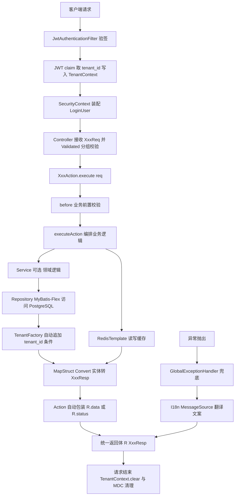

# ace-backend 架构设计说明书

| 项目 | 内容 |
| --- | --- |
| 文档名称 | ace-backend 架构设计说明书 |
| 版本 | v1.0 |
| 状态 | 待评审 |
| 编制日期 | 2026-08-31 |
| 作者 | guoym |
| 适用范围 | 公司多租户 SaaS 后台管理系统服务端 |
| 工程目录 | `04后端工程/ace-backend` |

---

## 1. 背景与设计目标

### 1.1 背景

公司需要一套面向多租户的后台管理系统服务端基座，支撑门店管理、CRM、ERP 等 SaaS 业务形态。核心诉求是：

- 多租户共用同一套代码、同一套接口、同一套数据库表，但**租户之间数据绝对隔离**
- 团队规模会扩大，需要一套**强制性的编码规范**，让不同水平的人写出的代码结构一致
- 接口文档需要能被 **Apifox** 直接识别，减少前后端联调成本

### 1.2 设计目标

| 目标 | 说明 |
| --- | --- |
| 技术栈先进性 | 采用 Spring Boot 4.1.1 + JDK 23 + Spring Security 7.1，享受新版本在性能与 API 上的改进 |
| 数据隔离安全性 | 租户隔离不依赖开发人员记性，由框架在 ORM 层强制生效 |
| 编码范式统一 | 一接口一 Action 类、Req/Resp 命名、Repository 层，新人照抄即可 |
| 接口文档自动化 | 以 Javadoc 注释为零侵入主方案，Apifox 可识别 |
| 可运维 | 多环境 profile、jar 启动脚本、链路追踪 ID |

### 1.3 非目标（本次不做）

对象存储、Excel 导入导出、限流熔断、可观测性体系、消息队列。这些能力仅在包结构上预留位置，不引入依赖、不写实现。

---

## 2. 技术栈选型与版本矩阵

### 2.1 环境要求

| 环境 | 版本 | 说明 |
| --- | --- | --- |
| JDK | **23.0.2** | 本机已安装 `Java(TM) SE Runtime Environment build 23.0.2+7-58` |
| Maven | **3.9.12** | 本机已安装于 `D:\apache-maven-3.9.12` |
| 数据库 | PostgreSQL | 建议 14 及以上（需支持 `GENERATED ... AS IDENTITY`，PG 10+ 即可） |
| 缓存 | Redis | 建议 6.0 及以上 |

### 2.2 依赖版本矩阵

> 以下版本均已通过 Maven Central / 官方文档核实（核实日期 2026-08-31），**不是凭记忆填写**。

| 组件 | Maven 坐标 | 版本 | 核实依据 |
| --- | --- | --- | --- |
| 父工程 | `org.springframework.boot:spring-boot-starter-parent` | **4.1.1** | Maven Central 目录含 `4.1.1/`（2026-08-20） |
| Web | `spring-boot-starter-web` | 随 Boot BOM | 4.1.1 下坐标未变 |
| 数据访问 | `com.mybatis-flex:mybatis-flex-spring-boot4-starter` | **1.11.8** | Maven Central 最新版（2026-07-01） |
| APT 处理器 | `com.mybatis-flex:mybatis-flex-processor` | 1.11.8 | 同上 |
| 数据库驱动 | `org.postgresql:postgresql` | 随 Boot BOM | 不手写版本 |
| 缓存 | `spring-boot-starter-data-redis` | 随 Boot BOM | 4.1.1 下坐标未变 |
| 安全 | `spring-boot-starter-security` | 随 Boot BOM | 实得 **Spring Security 7.1.0** |
| JWT | `spring-boot-starter-oauth2-resource-server`（内含 Nimbus JOSE） | 随 Boot BOM | Boot 4.1.0 release notes 明确内置 Security 7.1.0 |
| 对象转换 | `org.mapstruct:mapstruct` + `mapstruct-processor` | **1.6.3** | 最新稳定版；1.7.0 仍为 Beta2（2026-06-27） |
| 简化代码 | `org.projectlombok:lombok` | **1.18.46** | 覆盖 JDK 23/24/25/26 的最新版 |
| 处理器桥接 | `org.projectlombok:lombok-mapstruct-binding` | 0.2.0 | Lombok 与 MapStruct 协同必需 |
| 工具包 | `cn.hutool:hutool-bom` | 待定 | **落地时需从 Maven Central 核实最新稳定版** |
| 接口文档 | `org.springdoc:springdoc-openapi-starter-webmvc-api` | **3.1.0** | 其 pom 依赖 Boot 4 新增的 `spring-boot-webmvc`、`spring-boot-web-server` 模块，确认属 Boot 4 线 |

### 2.3 版本兼容性红线

| 红线 | 原因 |
| --- | --- |
| **必须用 `mybatis-flex-spring-boot4-starter`** | 通用的 `mybatis-flex-spring-boot-starter` 属 Boot 3 线，在 Boot 4 下自动配置失效 |
| **springdoc 必须用 3.x，不能用 2.8.x** | 2.8.17 是 Boot 3 线；3.x 才依赖 Boot 4 的新模块 |
| **MapStruct 用 1.6.3，不用 1.7.0** | 1.7.0 仍停留在 Beta2，生产不用非稳定版 |
| **不要单独指定 Spring Security 版本** | Boot 4.1.x 已内置 Security 7.1.0，手动指定会破坏 BOM 对齐 |
| **`maven.compiler.release` 不得高于 23** | 本机 JDK 为 23.0.2，设更高版本编译失败 |

### 2.4 Lombok 与 JDK 兼容矩阵（升级 JDK 时参考）

| JDK | 最低 Lombok 版本 |
| --- | --- |
| 21 (LTS) | 1.18.32 |
| 23 | 1.18.36 |
| 24 | 1.18.38 |
| 25 (LTS) | 1.18.40 |
| 26 | 1.18.46 |

> 当前选用 1.18.46，可平滑覆盖 JDK 23 ~ 26，后续升级 JDK 无需改 Lombok 版本。

---

## 3. 关键决策与理由

| # | 决策 | 理由 |
| --- | --- | --- |
| 1 | **MyBatis-Flex 用 Boot 4 专用 starter** | 通用 starter 属 Boot 3 线，混用导致自动配置失效 |
| 2 | **JWT 用 Nimbus JOSE，不用 jjwt** | `jjwt-jackson` 强依赖 Jackson 2，而 Boot 4 默认已是 Jackson 3，引入 jjwt 会直接触发依赖冲突；Nimbus 随 `oauth2-resource-server` 一并引入，零额外依赖 |
| 3 | **springdoc 用 3.x** | 3.1.0 的 pom 依赖 Boot 4 新增模块，确认属 Boot 4 线 |
| 4 | **租户隔离用框架原生机制，不用填充监听器** | 只有 `@Column(tenantId = true)` + `TenantManager` 才能在**查询时**自动追加 `tenant_id` 条件；`InsertListener` 只能管写入、管不了查询，用它做租户就是漏数据的开始 |
| 5 | **审计字段用全局 `registerInsertListener(listener, BaseEntity.class)`** | 官方支持注册到基类即对全部子类生效，避免在每张表上重复配注解 |
| 6 | **单模块优先，不拆多模块** | Boot 4 + JDK 23 + Jackson 3 组合破坏性变更多，单模块可将依赖冲突与 APT 问题排查成本降到最低；包结构已按分层与业务模块内聚预留，后续按领域拆模块成本低 |
| 7 | **层级边界：Controller 极薄 → Action → Service（可选）→ Repository** | Action 一接口一类，职责单一；Service 仅放跨 Action 复用的领域逻辑，简单查询类 Action 可直接调 Repository，不强制套 Service |

---

## 4. 整体架构与请求链路

### 4.1 请求链路



### 4.2 分层职责

| 层 | 包名后缀 | 职责 | 约束 |
| --- | --- | --- | --- |
| Controller | `.controller` | 接收 Req、分组校验、转发给 Action | **极薄**，禁止写业务逻辑 |
| Action | `.action` | 一接口一类，业务编排、事务边界、组装 Resp | 类名 `#{业务名称}Action` |
| Service | `.service` | 跨 Action 复用的领域逻辑 | 可选层，不强制 |
| Repository | `.repository` | 数据访问（原 mapper 层） | `XxxRepository extends BaseMapper<XxxEntity>` |
| Entity | `.entity` | 数据库实体 | 继承 `BaseEntity` |
| DTO | `.dto.req` / `.dto.resp` | 入参出参 | 入参 `XxxReq`，出参 `XxxResp` |
| Convert | `.convert` | MapStruct 转换器 | `@Mapper(componentModel = "spring")` |
| config | `.config` | 框架配置 | — |
| security | `.security` | 认证授权 | — |
| tenant | `.tenant` | 租户上下文 | — |

---

## 5. 编码规范

### 5.1 Action 编排范式

每个 API 接口对应一个 `AbstractActionTemplate` 实现类，**一个类只干一件事**。

**模板定义**（保留原始签名，做兼容性修正与最小增强）：

```java
/**
 * 业务抽象模板，子类实现execute即可，一个类干一件事
 *
 * @author guoym
 * @param <Request>  入参类型，约定为 #{业务名称}Req；无入参场景使用 EmptyReq
 * @param <Response> 出参类型，约定为 #{业务名称}Resp
 */
public abstract class AbstractActionTemplate<Request, Response> {

    /** 业务前置校验，默认空实现 */
    protected void before(Request request) {}

    /** 业务编排主体，由子类按需标注 @Transactional 控制事务边界 */
    protected abstract Response executeAction(Request request);

    /** 后置钩子，用于埋点、操作日志、后置缓存，默认空实现 */
    protected void after(Request request, Response response) {}

    public R<Response> execute(Request request) {
        before(request);
        Response response = executeAction(request);
        after(request, response);
        // JDK 16+ 模式匹配；response 为 null 时走 R.data(null)，语义为「成功但无数据」
        if (response instanceof Boolean bool) {
            return R.status(bool);
        }
        return R.data(response);
    }

    /** 无入参场景：约定 Request 为 EmptyReq，禁止直接传裸 null */
    public R<Response> execute() {
        return execute(null);
    }
}
```

> **⚠️ 原始模板的编译期硬伤**
>
> 原始代码中 `return R.status((Boolean) response);` 要求 `R.status` 能返回 `R<Response>`。
> 若 `R.status` 声明为返回 `R<Boolean>`，则**编译期类型不兼容**，模板根本无法落地。
> 因此 `R` 的所有静态工厂**必须泛型化**（见 5.4）。
>
> 另外两处修改：
> 1. `instanceof Boolean` → `instanceof Boolean bool`，使用 JDK 16+ 模式匹配，省去强转
> 2. 新增 `after` 钩子，用于埋点、操作日志、后置缓存

**Action 实现范式（查询类）**：

```java
/**
 * 分页查询用户列表
 */
@Component
public class UserPageAction extends AbstractActionTemplate<UserPageReq, PageResult<UserPageResp>> {

    /** 允许排序的字段白名单（下划线命名），防止排序字段被注入 */
    private static final Set<String> SORTABLE_COLUMNS =
            Set.of("create_time", "user_name", "status");

    @Resource
    private SysUserRepository sysUserRepository;

    @Override
    protected PageResult<UserPageResp> executeAction(UserPageReq req) {
        QueryWrapper query = QueryWrapper.create()
                .like(SysUser::getUserName, req.getKeyword());
        // 排序字段必须过白名单，见 5.2.5
        QueryKit.applyOrders(query, req.getOrders(), SORTABLE_COLUMNS);

        Page<SysUser> page = sysUserRepository.paginate(
                Page.of(req.getPageNumber(), req.getPageSize()), query);
        return PageResult.of(page, SysUserConvert.INSTANCE::toPageResp);
    }
}
```

**Action 实现范式（删除类）**：

```java
/**
 * 删除用户
 */
@Component
public class UserDeleteAction extends AbstractActionTemplate<DeleteReq, Boolean> {

    @Resource
    private SysUserRepository sysUserRepository;

    @Override
    @Transactional(rollbackFor = Exception.class)
    protected Boolean executeAction(DeleteReq req) {
        // 逻辑删除：MyBatis-Flex 自动把 is_deleted 置 1，并自动追加 tenant_id 条件
        return sysUserRepository.deleteById(req.getId()) > 0;
    }
}
```

> 删除类 Action 的 `Response` 泛型是 `Boolean`，这正是 `AbstractActionTemplate` 中
> `if (response instanceof Boolean bool) { return R.status(bool); }` 分支存在的意义——
> 无需每个删除接口自己包装返回体。

**Controller 一行转发**：

```java
/**
 * 用户管理
 */
@RestController
@RequestMapping("/system/user")
public class SysUserController {

    @Resource
    private UserPageAction userPageAction;

    @Resource
    private UserDeleteAction userDeleteAction;

    /**
     * 分页查询用户列表
     *
     * @param req 查询条件，keyword 为用户名模糊匹配；分页与排序字段继承自 PageReq
     * @return 用户分页数据
     */
    @GetMapping("/page")
    @PreAuthorize("hasAuthority('system:user:list')")
    public R<PageResult<UserPageResp>> page(@Validated UserPageReq req) {
        return userPageAction.execute(req);
    }

    /**
     * 删除用户
     *
     * @param req 删除入参，id 为待删除用户主键
     * @return 是否删除成功
     */
    @PostMapping("/delete")
    @PreAuthorize("hasAuthority('system:user:delete')")
    public R<Boolean> delete(@Validated @RequestBody DeleteReq req) {
        return userDeleteAction.execute(req);
    }
}
```

> **删除接口必须用 `POST /delete`，禁止 `DELETE`**：
> 全系统统一只用 `GET` / `POST`（见 11.5）。部分网关、负载均衡与客户端不支持 `DELETE` 携带 body，新增 / 编辑 / 删除一律走 `POST`，语义靠路径后缀（`/save`、`/update`、`/delete`）区分。

### 5.2 请求基类与 DTO 命名规范

#### 5.2.1 命名规范

| 场景 | 命名 | 示例 |
| --- | --- | --- |
| Controller 入参 | `#{业务名称}Req` | `UserPageReq`、`UserDetailReq`、`UserSaveReq` |
| Controller 出参 | `#{业务名称}Resp` | `UserPageResp`、`UserDetailResp` |
| 无入参接口 | `EmptyReq` | 约定类型，禁止传裸 `null` |

三个通用请求基类统一放在 `common.base` 包：

| 基类 | 用途 | 匹配的 Action 泛型 |
| --- | --- | --- |
| `PageReq` | 所有分页查询入参的父类 | `PageResult<XxxResp>` |
| `DeleteReq` | 按主键删除的入参 | `Boolean` |
| `EmptyReq` | 无入参接口 | 任意 |

#### 5.2.2 分页请求基类 PageReq

```java
/**
 * 分页请求基类
 * <p>
 * 所有分页查询入参继承本类，禁止在业务 Req 中重复声明 pageNumber / pageSize / orders
 *
 * @author guoym
 */
@Data
public class PageReq {

    /** 页码，从 1 开始，默认 1 */
    @NotNull(message = "{valid.page.number.notnull}")
    @Min(value = 1, message = "{valid.page.number.min}")
    private Integer pageNumber = 1;

    /** 每页条数，默认 10 */
    @NotNull(message = "{valid.page.size.notnull}")
    @Min(value = 1, message = "{valid.page.size.min}")
    @Max(value = 500, message = "{valid.page.size.max}")
    private Integer pageSize = 10;

    /** 排序条件，可为空；字段必须在接口白名单内 */
    private List<OrderItem> orders;

    /**
     * 排序项
     */
    @Data
    public static class OrderItem {

        /** 排序字段名，下划线命名，必须在接口白名单内 */
        @NotBlank(message = "{valid.order.column.notblank}")
        private String column;

        /** 是否升序：true-升序，false-降序，默认升序 */
        private Boolean asc = Boolean.TRUE;
    }
}
```

**字段说明**

| 字段 | 类型 | 默认 | 说明 |
| --- | --- | --- | --- |
| `pageNumber` | `Integer` | 1 | 页码，从 1 开始，与 MyBatis-Flex `Page.of(pageNumber, pageSize)` 对齐 |
| `pageSize` | `Integer` | 10 | 每页条数，上限 500，防止大页拖垮数据库 |
| `orders` | `List<OrderItem>` | null | 排序条件，支持多字段排序 |
| `orders[].column` | `String` | — | 下划线命名字段名，必须过白名单 |
| `orders[].asc` | `Boolean` | true | 升序标记 |

> **为什么 `pageSize` 要设上限**：`pageSize` 由前端传入，若不限制，一次查询百万行会直接打爆内存与数据库连接。
> 500 是后台管理场景的经验值，可按业务调整。

#### 5.2.3 删除请求基类 DeleteReq

```java
/**
 * 删除请求基类
 * <p>
 * 按主键删除的入参；批量删除场景另建 XxxBatchDeleteReq，不污染本基类
 *
 * @author guoym
 */
@Data
public class DeleteReq {

    /** 待删除记录主键 */
    @NotNull(message = "{valid.id.notnull}")
    private Long id;
}
```

> 与 `AbstractActionTemplate<DeleteReq, Boolean>` 搭配使用时，模板会自动走
> `R.status(bool)` 分支，删除接口无需自己包装返回体。

#### 5.2.4 无入参请求基类 EmptyReq

```java
/**
 * 无入参接口的约定入参
 * <p>
 * 用于 AbstractActionTemplate#execute() 的 Request 泛型，禁止直接传裸 null
 *
 * @author guoym
 */
public final class EmptyReq {

    public static final EmptyReq INSTANCE = new EmptyReq();

    private EmptyReq() {}
}
```

#### 5.2.5 排序字段安全（强制规范）

> **⚠️ 排序字段名无法用 JDBC 参数绑定**
>
> `ORDER BY ${column}` 中的列名是 SQL 结构的一部分，不是参数值，无法预编译绑定。
> 若直接把客户端传来的 `column` 拼进 SQL，就是**现成的 SQL 注入入口**。

**强制要求**：每个分页 Action 必须声明自己的排序字段白名单，前端传入的字段不在白名单内一律忽略或报错。

推荐用统一工具类，避免每个 Action 重复写：

```java
/**
 * 查询工具类
 */
public final class QueryKit {

    private QueryKit() {}

    /**
     * 应用排序条件（带字段白名单校验，防止 SQL 注入）
     *
     * @param wrapper      查询包装器
     * @param orders       排序条件，可为空
     * @param allowColumns 允许排序的字段白名单，下划线命名
     */
    public static void applyOrders(QueryWrapper wrapper,
                                   List<PageReq.OrderItem> orders,
                                   Set<String> allowColumns) {
        if (orders == null || orders.isEmpty() || allowColumns == null) {
            return;
        }
        for (PageReq.OrderItem item : orders) {
            String column = item.getColumn();
            if (column == null || !allowColumns.contains(column)) {
                continue;   // 或抛 BizException，二选一但全工程必须统一
            }
            boolean asc = !Boolean.FALSE.equals(item.getAsc());
            wrapper.orderBy(column + (asc ? " asc" : " desc"));
        }
    }
}
```

配套规则：

1. 白名单用 `Set.of(...)` 声明为 `static final`，字段名统一下划线
2. 校验失败时的行为（忽略 vs 抛异常）全工程统一，推荐**忽略**（避免前端字段名微调导致接口报错）
3. 禁止把 `QueryWrapper` 的排序方法直接暴露给前端字段名
4. 该规则属代码审查项

#### 5.2.6 业务 Req 编写示例

业务 Req 继承基类，只声明自己的业务字段；
校验注解的 message **必须使用国际化占位符键**，不得硬编码中文。

```java
/**
 * 分页查询用户入参
 */
@Data
@EqualsAndHashCode(callSuper = true)
public class UserPageReq extends PageReq {

    /** 关键字，匹配用户名或手机号 */
    private String keyword;

    /** 状态：1-正常，0-停用，为空表示不限 */
    private Integer status;
}
```

```java
/**
 * 保存用户入参
 */
@Data
public class UserSaveReq {

    /** 用户 ID，新增时为空，更新时必填 */
    @Null(groups = AddGroup.class, message = "{valid.user.id.null}")
    @NotNull(groups = UpdateGroup.class, message = "{valid.user.id.notnull}")
    private Long id;

    /** 登录账号 */
    @NotBlank(message = "{valid.user.name.notblank}")
    @Size(max = 64, message = "{valid.user.name.size}")
    private String userName;

    /** 手机号 */
    @Pattern(regexp = "^1[3-9]\\d{9}$", message = "{valid.user.phone.pattern}")
    private String phone;
}
```

### 5.3 Repository 层规范

原 mapper 层统一改名为 repository：

```java
/**
 * 用户数据访问层
 */
public interface SysUserRepository extends BaseMapper<SysUser> {
}
```

启动类配置扫描：

```java
@SpringBootApplication
@MapperScan("com.gm.ace.**.repository")
public class AceBackendApplication {
    public static void main(String[] args) {
        SpringApplication.run(AceBackendApplication.class, args);
    }
}
```

### 5.4 统一返回体 R&lt;T&gt;

```java
/**
 * 统一返回体
 *
 * @param <T> 数据类型
 */
public final class R<T> implements Serializable {

    /** 业务状态码 */
    private int code;
    /** 提示消息 */
    private String message;
    /** 业务数据 */
    private T data;
    /** 时间戳 */
    private long timestamp;
    /** 链路追踪 ID */
    private String traceId;

    /**
     * 泛型静态工厂：返回 R&lt;T&gt; 而非 R&lt;Boolean&gt;
     * 否则 AbstractActionTemplate 中 R.status(...) 无法赋值给 R&lt;Response&gt;
     */
    public static <T> R<T> data(T data) { /* ... */ }

    public static <T> R<T> status(boolean success) { /* ... */ }

    public static <T> R<T> ok() { /* ... */ }

    public static <T> R<T> fail(ResultCode resultCode) { /* ... */ }

    public static <T> R<T> fail(ResultCode resultCode, String message) { /* ... */ }
}
```

**返回码枚举** `ResultCode`：

| 枚举 | code | 说明 |
| --- | --- | --- |
| `SUCCESS` | 200 | 成功 |
| `BIZ_ERROR` | 1000 | 业务失败 |
| `PARAM_ERROR` | 1001 | 参数错误 |
| `UNAUTHORIZED` | 401 | 未认证 |
| `FORBIDDEN` | 403 | 未授权 |
| `NOT_FOUND` | 404 | 资源不存在 |
| `SYSTEM_ERROR` | 500 | 系统异常 |

### 5.5 MapStruct 转换规范

实体与 DTO 之间的转换统一由 MapStruct **编译期**生成，禁止使用 `BeanUtils.copyProperties`（反射、运行期、字段改名无法在编译期发现）。

三个公共转换组件统一放在 `com.gm.ace.common.convert` 包。

#### 5.5.1 类型转换器基类 BaseConverter

提供 MapStruct 未内置的 Java 8 时间类型与 `Date` / `String` 互转方法，供所有 Mapper 通过 `uses` 引用。

```java
package com.gm.ace.common.convert;

import com.gm.ace.common.constant.AceConst;

import java.time.*;
import java.util.Date;

/**
 * 通用类型转换器基类
 * <p>
 * 通过 @Mapper(uses = BaseConverter.class) 引用，MapStruct 会自动调用其中的静态方法
 *
 * @author guoym
 */
public interface BaseConverter {

    /** Date → LocalDateTime，按系统时区转换 */
    static LocalDateTime dateToLocalDateTime(Date date) {
        return date == null ? null
                : date.toInstant().atZone(AceConst.TIME_ZONE.toZoneId()).toLocalDateTime();
    }

    /** Date → LocalDate，按系统时区转换 */
    static LocalDate dateToLocalDate(Date date) {
        return date == null ? null
                : date.toInstant().atZone(AceConst.TIME_ZONE.toZoneId()).toLocalDate();
    }

    /** String → YearMonth，MapStruct 无内置转换，需自定义 */
    static YearMonth stringToYearMonth(String yearMonth) {
        return yearMonth == null || yearMonth.isEmpty() ? null : YearMonth.parse(yearMonth);
    }

    /** YearMonth → String */
    static String yearMonthToString(YearMonth yearMonth) {
        return yearMonth == null ? null : yearMonth.toString();
    }

    /** LocalDate → Date，按系统时区转换 */
    static Date localDateToDate(LocalDate localDate) {
        return localDate == null ? null
                : Date.from(localDate.atStartOfDay(AceConst.TIME_ZONE.toZoneId()).toInstant());
    }

    /** LocalDateTime → Date，按系统时区转换 */
    static Date localDateTimeToDate(LocalDateTime localDateTime) {
        return localDateTime == null ? null
                : Date.from(localDateTime.atZone(AceConst.TIME_ZONE.toZoneId()).toInstant());
    }
}
```

配套常量（`com.gm.ace.common.constant.AceConst`）：

```java
/** 系统默认时区，Date 与 LocalDateTime 互转统一使用，避免隐式使用 JVM 默认时区 */
public static final TimeZone TIME_ZONE = TimeZone.getTimeZone("Asia/Shanghai");
```

> **约定**：实体与 DTO 的时间字段**优先使用 `LocalDateTime` / `LocalDate`**，
> `BaseConverter` 中的 `Date` 转换仅用于对接遗留表或第三方 SDK 类型，新表不得使用 `java.util.Date`。

#### 5.5.2 深拷贝控制 NoDirectMapping

MapStruct 默认行为：**当源与目标属性类型相同时直接赋值**（引用拷贝）。实体间复制嵌套对象时，这会导致源与目标共享同一引用，改一边影响另一边。

`NoDirectMapping` 通过排除 `MappingControl.Use.DIRECT`，强制 MapStruct 生成子映射方法，实现深拷贝：

```java
package com.gm.ace.common.convert;

import org.mapstruct.control.MappingControl;

import java.lang.annotation.Retention;
import java.lang.annotation.RetentionPolicy;

/**
 * MapStruct 的 mappingControl，用于实现同类型间的深拷贝
 * 例：@BeanMapping(mappingControl = NoDirectMapping.class)
 *
 * @author guoym
 */
@Retention(RetentionPolicy.CLASS)
@MappingControl(MappingControl.Use.BUILT_IN_CONVERSION)
@MappingControl(MappingControl.Use.MAPPING_METHOD)
@MappingControl(MappingControl.Use.COMPLEX_MAPPING)
public @interface NoDirectMapping {
}
```

**四种映射控制（MapStruct 官方定义）**

| 枚举 | 含义 |
| --- | --- |
| `DIRECT` | 源与目标类型相同时**直接赋值**（引用拷贝） |
| `BUILT_IN_CONVERSION` | 内置类型转换（如 `int` ↔ `String`、枚举 ↔ `String`） |
| `MAPPING_METHOD` | 调用已有的映射方法 |
| `COMPLEX_MAPPING` | 组合映射，或生成子映射方法 |

> 缺省时四者全部启用；`NoDirectMapping` 只启用后三者，从而关掉 `DIRECT`。

**使用方式**：按方法粒度使用，不要放到 `@Mapper` 上全局开启。

```java
/**
 * 复制出一个新的用户实体（深拷贝，嵌套对象不共享引用）
 */
@BeanMapping(mappingControl = NoDirectMapping.class)
SysUser copy(SysUser source);
```

**注意事项**

1. 该注解与 MapStruct 内置的 `@DeepClone`（1.4+）语义完全一致，自定义命名可读性更好，二选一即可
2. `MappingControl` 在 MapStruct 中标记为 **experimental**（自 1.4 起），后续大版本需回归验证
3. 排除 `DIRECT` 后，MapStruct 对无法映射的类型会**直接报编译错误**——这正是期望行为：宁可编译失败，也不要静默共享引用
4. 简单类型（`String`、基本类型）会由 MapStruct 自动生成同类型子映射方法，不会报错，但会多生成少量方法

#### 5.5.3 忽略基类字段 IgnoreBaseEntity

实体间复制或更新时，基类字段（`id`、审计字段、租户字段）不允许被覆盖。用 `@Mapping` 组合注解一次性忽略：

```java
package com.gm.ace.common.convert;

import org.mapstruct.Mapping;

import java.lang.annotation.*;

/**
 * 添加到 MapStruct 的 Mapper 方法上，用于忽略 BaseEntity 的字段
 * 常用于实体间的转换或复制，避免覆盖主键、审计字段与租户字段
 *
 * @author guoym
 */
@Documented
@Retention(RetentionPolicy.CLASS)
@Target({ElementType.METHOD, ElementType.ANNOTATION_TYPE})
@Mapping(target = "id", ignore = true)
@Mapping(target = "createBy", ignore = true)
@Mapping(target = "createTime", ignore = true)
@Mapping(target = "updateBy", ignore = true)
@Mapping(target = "updateTime", ignore = true)
@Mapping(target = "tenantId", ignore = true)
@Mapping(target = "isDeleted", ignore = true)
public @interface IgnoreBaseEntity {
}
```

> **⚠️ 字段清单已按本项目 `BaseEntity` 调整**（原文件来自 `com.ace.web` 工程，字段命名不同）：
>
> | 原字段 | 本项目 | 说明 |
> | --- | --- | --- |
> | `createUser` | `createBy` | 命名对齐 |
> | `updateUser` | `updateBy` | 命名对齐 |
> | `createDept` | **移除** | 本项目 `BaseEntity` 无「创建部门」字段；将来做数据权限时再单独加 |
> | — | **新增 `tenantId`** | 租户字段必须忽略，否则实体间复制可能把记录改成另一个租户，属越权风险 |

**使用方式**

```java
@Mapper(componentModel = "spring", uses = BaseConverter.class)
public interface SysUserConvert {

    /**
     * 用 Req 更新已有实体，基类字段一律不覆盖
     */
    @IgnoreBaseEntity
    void updateFrom(UserSaveReq req, @MappingTarget SysUser target);
}
```

**注意事项**

1. **目标类型必须真的有这些属性**：`@Mapping(target = "x", ignore = true)` 在目标 bean 不存在该属性时会报
   `Unknown property "x" in result type` 编译错误。因此本注解**只能用于目标为 `BaseEntity` 子类的方法**
2. 该机制基于 MapStruct 的元注解（Mapping Composition）能力，官方文档明确提示其**错误信息不够成熟**，
   定位问题时需结合方法签名排查
3. 若 `BaseEntity` 后续新增字段，**必须同步更新本注解**，否则新增字段会被意外覆盖

#### 5.5.4 Mapper 标准写法

```java
package com.gm.ace.module.system.convert;

import com.gm.ace.common.convert.BaseConverter;
import org.mapstruct.Mapper;
import org.mapstruct.ReportingPolicy;

/**
 * 用户实体与 DTO 转换器
 */
@Mapper(
        componentModel = "spring",                    // 生成 Spring Bean，可 @Resource 注入
        uses = BaseConverter.class,                   // 引用通用类型转换方法
        unmappedTargetPolicy = ReportingPolicy.IGNORE // 实体字段多于 DTO 时不告警
)
public interface SysUserConvert {

    /** 实体转分页出参 */
    UserPageResp toPageResp(SysUser entity);

    /** 实体转详情出参 */
    UserDetailResp toDetailResp(SysUser entity);

    /** 实体列表转出参列表 */
    List<UserPageResp> toPageRespList(List<SysUser> entities);
}
```

**规范要点**

| 项 | 要求 |
| --- | --- |
| `componentModel` | 固定为 `spring`，通过 `@Resource` 注入，不用 `Mappers.getMapper()` |
| `uses` | 固定引用 `BaseConverter.class` |
| `unmappedTargetPolicy` | 实体转 DTO 用 `IGNORE`（实体字段天然多于 DTO） |
| 命名 | 方法名用 `to` + 目标名，如 `toPageResp`、`toDetailResp` |
| 复杂逻辑 | 无法自动映射的字段，用 `default` 方法手写，不用 `expression` |

#### 5.5.5 已知注意事项

| # | 事项 | 应对 |
| --- | --- | --- |
| 1 | Lombok 与 MapStruct 必须共存于注解处理器链 | `annotationProcessorPaths` 中 `lombok-mapstruct-binding` 必须夹在两者之间，见附录 B.1 |
| 2 | Boot 4 引入 JSpecify 空安全注解 | 可能影响 MapStruct 生成代码的 null 处理，落地时需实测 |
| 3 | `MappingControl` 为实验特性 | 变更 MapStruct 大版本时需回归验证深拷贝行为 |
| 4 | `IgnoreBaseEntity` 只能用于 `BaseEntity` 子类目标 | 否则编译报 `Unknown property` |
| 5 | `BaseEntity` 增减字段需同步 `IgnoreBaseEntity` | 纳入 Code Review 检查项 |

---

## 6. 多租户设计

### 6.1 隔离方案选型

多租户常见三种方案：

| 方案 | 隔离强度 | 运维成本 | 结论 |
| --- | --- | --- | --- |
| 每租户独立数据库 | 最强 | 极高（连接池、迁移、监控、备份 × N） | 不采用 |
| 每租户独立 Schema | 较强 | 高（Schema 数量膨胀后运维复杂） | 不采用 |
| **共享库共享表 + `tenant_id` 列** | 够用 | 低 | **采用** |

> 本方案适合「租户数量多、单租户数据规模未大到必须独占数据库」的中小 SaaS，与我们的业务形态匹配。

### 6.2 租户三条红线（团队强制规范）

> **红线一：`tenantId` 只信验签后的 JWT，绝不信任客户端声明**
>
> 禁止从 `X-Tenant-Id` 请求头或 `?tenantId=` 请求参数取值。攻击者改一个请求头就能串租户。
> 租户 ID 必须来自已通过 Spring Security 验签的 JWT claim。

> **红线二：原生 SQL 不会自动隔离**
>
> 以下场景 `tenant_id` 条件**不会**自动追加，属强制代码审查项：
> - XML mapper 中手写的 SQL
> - MyBatis-Flex 的 `Db + Row` 操作
> - 手写的复杂 `QueryWrapper` / 原生 SQL
>
> 这些场景必须自己带上 `tenant_id`，且取值同样只能来自 `TenantContext`。

> **红线三：异步任务 / MQ / 定时任务必须显式传播租户上下文**
>
> `ThreadLocal` 不会自动跨线程，`SecurityContext` 不会自动跟随 `@Async`。
> 必须显式携带并恢复 tenantId，否则异步逻辑会以「无租户」状态执行，导致全表可见或查询异常。

### 6.3 核心实现

**TenantContext（租户上下文）**

```java
/**
 * 租户上下文
 * 租户 ID 只由 JwtAuthenticationFilter 在验签通过后写入，严禁取自请求头或请求参数
 */
public final class TenantContext {

    private static final ThreadLocal<Long> HOLDER = new ThreadLocal<>();

    private TenantContext() {}

    public static void set(Long tenantId) {
        HOLDER.set(tenantId);
    }

    public static Long get() {
        return HOLDER.get();
    }

    public static void clear() {
        HOLDER.remove();
    }

    /**
     * 异步任务 / MQ / 定时任务必须用它显式传播租户，内部 try/finally 保证清理
     */
    public static <T> T runWith(Long tenantId, Supplier<T> supplier) {
        Long original = get();
        try {
            set(tenantId);
            return supplier.get();
        } finally {
            if (original == null) {
                clear();
            } else {
                set(original);
            }
        }
    }
}
```

**TenantFactory 实现**

```java
/**
 * 租户工厂：只从 TenantContext 读取租户 ID
 */
@Component
public class TenantFactoryImpl implements TenantFactory {

    @Override
    public Object[] getTenantIds() {
        Long tenantId = TenantContext.get();
        // 返回 null 或空数组表示忽略租户条件（如平台运营跨租户查询）
        return tenantId == null ? null : new Object[]{tenantId};
    }
}
```

**MyBatis-Flex 行为说明（官方语义）**

| 操作 | 行为 |
| --- | --- |
| 新增 | 无论实体设置什么 `tenantId`，都会被 `TenantFactory` 返回数组的**第一个值覆盖**；若返回 `null` 或空数组，则保留实体设置的值 |
| 删除 | 自动追加 `tenant_id = ?`；返回多个值时为 `tenant_id in (?, ?, ?)` |
| 修改 | 同上 |
| 查询 | 同上 |
| 忽略租户 | 用 `TenantManager.withoutTenantCondition(supplier)`（模板方法，自动恢复），或 `ignoreTenantCondition()` + `restoreTenantCondition()` 配 `try/finally` |

**清理时机（关键）**

`JwtAuthenticationFilter` 必须在 `finally` 中执行 `TenantContext.clear()` 与 `MDC.clear()`，
否则 Tomcat 线程池复用会导致**串租户、串 traceId**。

### 6.4 异步与消息场景的租户传播

```java
// ❌ 错误：异步方法里没有租户上下文
@Async
public void generateReport() {
    orderRepository.selectAll();  // 没有 tenant_id 条件
}

// ✅ 正确：显式传播
public void triggerReport(Long tenantId) {
    asyncReportService.generateReport(tenantId);
}

@Async
public void generateReport(Long tenantId) {
    TenantContext.runWith(tenantId, () -> {
        orderRepository.selectAll();  // 自动带上 tenant_id
        return null;
    });
}
```

MQ 场景：消息体必须携带 `tenantId`，消费端先 `TenantContext.runWith(...)` 再执行业务。

### 6.5 索引规范（多租户下的强制要求）

| 规则 | 反例 | 正例 |
| --- | --- | --- |
| 唯一索引必须 `tenant_id` 前置 | `uk_role_code(role_code)` | `uk_tenant_role_code(tenant_id, role_code)` |
| 普通查询索引 `tenant_id` 前置 | `idx_status(status)` | `idx_tenant_status(tenant_id, status)` |

> **原因**：不同租户完全可能拥有相同的业务编码（如 A 租户和 B 租户都有 `role_code = 'ADMIN'`）。
> 若唯一索引不含 `tenant_id`，第二个租户创建相同编码时会报唯一键冲突；
> 若改为全局唯一，则业务上又不合理。真正的唯一键是 `(tenant_id, business_key)`。

---

## 7. 实体基类与字段自动注入

### 7.1 BaseEntity

```java
/**
 * 实体基类：通用字段统一管理
 * 审计字段（createBy/createTime/updateBy/updateTime）由全局填充监听器自动注入
 * 租户字段（tenantId）由 MyBatis-Flex 多租户机制自动处理
 */
@Getter
@Setter
public abstract class BaseEntity implements Serializable {

    /** 主键，对应 bigint GENERATED BY DEFAULT AS IDENTITY */
    @Id(keyType = KeyType.Auto)
    private Long id;

    /** 创建人 */
    private Long createBy;

    /** 创建时间 */
    private LocalDateTime createTime;

    /** 修改人 */
    private Long updateBy;

    /** 修改时间 */
    private LocalDateTime updateTime;

    /** 租户 ID，由 TenantFactory 在增删改查时强制处理 */
    @Column(tenantId = true)
    private Long tenantId;

    /**
     * 逻辑删除标记
     * 列名用 is_deleted 而非 deleted，避免与 SQL 关键字 / 构造器语义混淆
     */
    @Column(value = "is_deleted", isLogicDelete = true)
    private Integer isDeleted;

    // 注意：乐观锁 version 不在基类中声明
    // 有特殊业务需要时，在具体实体上单独添加 @Column(version = true) private Integer version;
}
```

**字段说明**

| 字段 | 类型 | 注入方式 | 说明 |
| --- | --- | --- | --- |
| `id` | `Long` | 数据库自增 | `@Id(keyType = KeyType.Auto)` + PG `identity` |
| `createBy` | `Long` | 全局 InsertListener | 取当前登录用户 ID |
| `createTime` | `LocalDateTime` | 全局 InsertListener | JVM 时间 |
| `updateBy` | `Long` | Insert/Update Listener | 取当前登录用户 ID |
| `updateTime` | `LocalDateTime` | Insert/Update Listener | JVM 时间 |
| `tenantId` | `Long` | MyBatis-Flex 多租户 | 只能在**查询**时自动隔离，故用框架原生机制 |
| `isDeleted` | `Integer` | MyBatis-Flex 逻辑删除 | 0 正常，1 已删除 |

**为什么 `version` 不进基类**：乐观锁使用频率低，冗余到基类会让所有表都多一个无用列。有特殊并发控制需求时，在具体实体上单独声明即可。

### 7.2 审计字段全局填充

MyBatis-Flex 提供两种填充机制，本方案的分工是：

| 机制 | 层次 | 用途 | 本项目是否采用 |
| --- | --- | --- | --- |
| `@Table(onInsert = ...)` / `onUpdate = ...` 监听器 | **Java 应用层** | 注入需要从上下文取值的字段（如当前登录人） | **采用** |
| `@Column(onInsertValue = "now()")` | **数据库层** | 值直接拼进 SQL（如 `now()`、`version + 1`） | 不采用 |

> **为什么时间字段不用 `onInsertValue = "now()"`**：
> 审计字段需要与登录人一起维护，且避免数据库时钟与 JVM 时钟不一致导致的时间错乱。

**插入监听器**

```java
/**
 * 实体插入监听器：注入创建人与创建时间
 * 注册到 BaseEntity 后，所有继承 BaseEntity 的子类均生效
 */
public class BaseEntityInsertListener implements InsertListener {

    @Override
    public void onInsert(Object entity) {
        if (entity instanceof BaseEntity base) {
            Long userId = LoginUserContext.getUserId();
            LocalDateTime now = LocalDateTime.now();
            base.setCreateBy(userId);
            base.setUpdateBy(userId);
            base.setCreateTime(now);
            base.setUpdateTime(now);
        }
    }
}
```

**更新监听器**

```java
/**
 * 实体更新监听器：注入修改人与修改时间
 */
public class BaseEntityUpdateListener implements UpdateListener {

    @Override
    public void onUpdate(Object entity) {
        if (entity instanceof BaseEntity base) {
            base.setUpdateBy(LoginUserContext.getUserId());
            base.setUpdateTime(LocalDateTime.now());
        }
    }
}
```

**全局注册**

```java
@Configuration
public class MybatisFlexConfig {

    public MybatisFlexConfig() {
        FlexGlobalConfig config = FlexGlobalConfig.getDefaultConfig();
        // 注册到基类，所有继承 BaseEntity 的子类均生效
        config.registerInsertListener(new BaseEntityInsertListener(), BaseEntity.class);
        config.registerUpdateListener(new BaseEntityUpdateListener(), BaseEntity.class);
        // 全局租户列名与逻辑删除列名
        config.setTenantColumn("tenant_id");
        config.setLogicDeleteColumn("is_deleted");
    }
}
```

### 7.3 填充机制的边界（必须知道的坑）

> **⚠️ `onInsert` / `onUpdate` 监听器只对通过 Mapper 的操作生效**
>
> 通过 **XML mapper 插入**、或通过 **`Db + Row` 插入**，**不会触发** `onInsert` / `onUpdate`。
> 这些路径的审计字段需要自行处理，属代码审查项。

---

## 8. 数据库设计

### 8.1 表清单

| 表名 | 说明 | 是否带 `tenant_id` |
| --- | --- | --- |
| `sys_tenant` | 租户主表 | ❌ 平台级，自身不带 |
| `sys_user` | 用户表 | ✅ |
| `sys_role` | 角色表 | ✅ |
| `sys_menu` | 菜单权限表 | ❌ 平台级共享，租户只能分配不能新建 |
| `sys_user_role` | 用户角色关联 | ✅ |
| `sys_role_menu` | 角色菜单关联 | ✅ |
| `sys_login_log` | 登录日志 | ✅ |

**设计要点**

- `sys_menu` 为平台级共享数据，所有租户共用同一套菜单定义，租户仅通过 `sys_role_menu` 决定自己的角色能访问哪些菜单
- `sys_login_log` 为追加写日志表，**不设** `create_by` / `update_by` / `is_deleted`（不做逻辑删除，不做更新）

### 8.2 命名规范

| 规则 | 说明 |
| --- | --- |
| 表名 / 字段名 | 小写 + 下划线，与 PostgreSQL 标识符大小写敏感特性匹配 |
| 主键 | `bigint GENERATED BY DEFAULT AS IDENTITY`，配 `@Id(keyType = KeyType.Auto)` |
| 逻辑删除列 | 统一 `is_deleted`，`smallint`，默认 0 |
| 租户列 | 统一 `tenant_id`，`bigint not null default 0` |
| 索引 | 业务索引一律 `tenant_id` 前置 |

### 8.3 DDL 正文

```sql
-- =============================================================
-- ace-backend 数据库初始化脚本
-- 数据库：PostgreSQL 14+
-- 规范：小写下划线命名；主键 identity 自增；业务索引 tenant_id 前置
-- =============================================================

-- ----------------------------
-- 1、租户表（平台级，自身不带 tenant_id）
-- ----------------------------
CREATE TABLE sys_tenant (
    id            bigint       GENERATED BY DEFAULT AS IDENTITY NOT NULL,
    tenant_name   varchar(128) NOT NULL,
    tenant_code   varchar(64)  NOT NULL,
    status        smallint     NOT NULL DEFAULT 1,
    contact_name  varchar(64),
    contact_phone varchar(32),
    expire_time   timestamp,
    create_by     bigint,
    create_time   timestamp,
    update_by     bigint,
    update_time   timestamp,
    is_deleted    smallint     NOT NULL DEFAULT 0,
    CONSTRAINT pk_sys_tenant PRIMARY KEY (id)
);
COMMENT ON TABLE  sys_tenant            IS '租户表';
COMMENT ON COLUMN sys_tenant.id         IS '主键';
COMMENT ON COLUMN sys_tenant.tenant_name IS '租户名称';
COMMENT ON COLUMN sys_tenant.tenant_code IS '租户编码，全局唯一';
COMMENT ON COLUMN sys_tenant.status     IS '状态：1-启用，0-停用';
COMMENT ON COLUMN sys_tenant.expire_time IS '到期时间';
COMMENT ON COLUMN sys_tenant.is_deleted IS '逻辑删除：0-正常，1-已删除';
CREATE UNIQUE INDEX uk_tenant_code ON sys_tenant (tenant_code) WHERE is_deleted = 0;

-- ----------------------------
-- 2、用户表
-- ----------------------------
CREATE TABLE sys_user (
    id              bigint       GENERATED BY DEFAULT AS IDENTITY NOT NULL,
    tenant_id       bigint       NOT NULL DEFAULT 0,
    user_name       varchar(64)  NOT NULL,
    nick_name       varchar(64),
    password        varchar(128) NOT NULL,
    email           varchar(128),
    phone           varchar(32),
    sex             smallint     DEFAULT 0,
    avatar          varchar(512),
    status          smallint     NOT NULL DEFAULT 1,
    last_login_time timestamp,
    last_login_ip   varchar(64),
    create_by       bigint,
    create_time     timestamp,
    update_by       bigint,
    update_time     timestamp,
    is_deleted      smallint     NOT NULL DEFAULT 0,
    CONSTRAINT pk_sys_user PRIMARY KEY (id)
);
COMMENT ON TABLE  sys_user              IS '用户表';
COMMENT ON COLUMN sys_user.tenant_id    IS '租户 ID';
COMMENT ON COLUMN sys_user.user_name    IS '登录账号';
COMMENT ON COLUMN sys_user.nick_name    IS '用户昵称';
COMMENT ON COLUMN sys_user.password     IS '密码（强哈希存储，禁止明文）';
COMMENT ON COLUMN sys_user.status       IS '状态：1-正常，0-停用';
COMMENT ON COLUMN sys_user.is_deleted   IS '逻辑删除：0-正常，1-已删除';
-- 唯一索引必须 tenant_id 前置：不同租户可以有相同登录账号
CREATE UNIQUE INDEX uk_tenant_user_name ON sys_user (tenant_id, user_name) WHERE is_deleted = 0;
CREATE INDEX idx_tenant_status ON sys_user (tenant_id, status);

-- ----------------------------
-- 3、角色表
-- ----------------------------
CREATE TABLE sys_role (
    id          bigint       GENERATED BY DEFAULT AS IDENTITY NOT NULL,
    tenant_id   bigint       NOT NULL DEFAULT 0,
    role_name   varchar(64)  NOT NULL,
    role_code   varchar(64)  NOT NULL,
    sort_num    integer      NOT NULL DEFAULT 0,
    status      smallint     NOT NULL DEFAULT 1,
    remark      varchar(512),
    create_by   bigint,
    create_time timestamp,
    update_by   bigint,
    update_time timestamp,
    is_deleted  smallint     NOT NULL DEFAULT 0,
    CONSTRAINT pk_sys_role PRIMARY KEY (id)
);
COMMENT ON TABLE  sys_role            IS '角色表';
COMMENT ON COLUMN sys_role.tenant_id  IS '租户 ID';
COMMENT ON COLUMN sys_role.role_name  IS '角色名称';
COMMENT ON COLUMN sys_role.role_code  IS '角色编码，租户内唯一';
COMMENT ON COLUMN sys_role.sort_num   IS '排序号';
-- 典型示例：role_code 在租户内唯一，而非全局唯一
CREATE UNIQUE INDEX uk_tenant_role_code ON sys_role (tenant_id, role_code) WHERE is_deleted = 0;

-- ----------------------------
-- 4、菜单权限表（平台级，租户共享，不带 tenant_id）
-- ----------------------------
CREATE TABLE sys_menu (
    id          bigint       GENERATED BY DEFAULT AS IDENTITY NOT NULL,
    parent_id   bigint       NOT NULL DEFAULT 0,
    menu_name   varchar(64)  NOT NULL,
    menu_type   char(1)      NOT NULL,
    path        varchar(256),
    component   varchar(256),
    perms       varchar(128),
    icon        varchar(128),
    sort_num    integer      NOT NULL DEFAULT 0,
    visible     smallint     NOT NULL DEFAULT 1,
    status      smallint     NOT NULL DEFAULT 1,
    remark      varchar(512),
    create_by   bigint,
    create_time timestamp,
    update_by   bigint,
    update_time timestamp,
    is_deleted  smallint     NOT NULL DEFAULT 0,
    CONSTRAINT pk_sys_menu PRIMARY KEY (id)
);
COMMENT ON TABLE  sys_menu            IS '菜单权限表（平台级，租户共享）';
COMMENT ON COLUMN sys_menu.parent_id  IS '父菜单 ID，0 为顶级';
COMMENT ON COLUMN sys_menu.menu_name  IS '菜单名称';
COMMENT ON COLUMN sys_menu.menu_type  IS '类型：M-目录，C-菜单，F-按钮';
COMMENT ON COLUMN sys_menu.perms      IS '权限标识，如 system:user:list';
COMMENT ON COLUMN sys_menu.visible    IS '是否可见：1-可见，0-隐藏';
CREATE INDEX idx_menu_parent ON sys_menu (parent_id);
CREATE UNIQUE INDEX uk_menu_perms ON sys_menu (perms) WHERE is_deleted = 0 AND perms IS NOT NULL;

-- ----------------------------
-- 5、用户角色关联表
-- ----------------------------
CREATE TABLE sys_user_role (
    id          bigint   GENERATED BY DEFAULT AS IDENTITY NOT NULL,
    tenant_id   bigint   NOT NULL DEFAULT 0,
    user_id     bigint   NOT NULL,
    role_id     bigint   NOT NULL,
    create_by   bigint,
    create_time timestamp,
    is_deleted  smallint NOT NULL DEFAULT 0,
    CONSTRAINT pk_sys_user_role PRIMARY KEY (id)
);
COMMENT ON TABLE  sys_user_role          IS '用户角色关联表';
COMMENT ON COLUMN sys_user_role.tenant_id IS '租户 ID';
COMMENT ON COLUMN sys_user_role.user_id  IS '用户 ID';
COMMENT ON COLUMN sys_user_role.role_id  IS '角色 ID';
CREATE UNIQUE INDEX uk_tenant_user_role ON sys_user_role (tenant_id, user_id, role_id) WHERE is_deleted = 0;
CREATE INDEX idx_tenant_role ON sys_user_role (tenant_id, role_id);

-- ----------------------------
-- 6、角色菜单关联表
-- ----------------------------
CREATE TABLE sys_role_menu (
    id          bigint   GENERATED BY DEFAULT AS IDENTITY NOT NULL,
    tenant_id   bigint   NOT NULL DEFAULT 0,
    role_id     bigint   NOT NULL,
    menu_id     bigint   NOT NULL,
    create_by   bigint,
    create_time timestamp,
    is_deleted  smallint NOT NULL DEFAULT 0,
    CONSTRAINT pk_sys_role_menu PRIMARY KEY (id)
);
COMMENT ON TABLE  sys_role_menu           IS '角色菜单关联表';
COMMENT ON COLUMN sys_role_menu.tenant_id IS '租户 ID';
COMMENT ON COLUMN sys_role_menu.role_id   IS '角色 ID';
COMMENT ON COLUMN sys_role_menu.menu_id   IS '菜单 ID';
CREATE UNIQUE INDEX uk_tenant_role_menu ON sys_role_menu (tenant_id, role_id, menu_id) WHERE is_deleted = 0;
CREATE INDEX idx_tenant_menu ON sys_role_menu (tenant_id, menu_id);

-- ----------------------------
-- 7、登录日志表（追加写，不做逻辑删除与更新）
-- ----------------------------
CREATE TABLE sys_login_log (
    id          bigint       GENERATED BY DEFAULT AS IDENTITY NOT NULL,
    tenant_id   bigint       NOT NULL DEFAULT 0,
    user_name   varchar(64),
    ip          varchar(64),
    browser     varchar(128),
    os          varchar(128),
    status      smallint     NOT NULL DEFAULT 1,
    msg         varchar(512),
    login_time  timestamp    NOT NULL,
    CONSTRAINT pk_sys_login_log PRIMARY KEY (id)
);
COMMENT ON TABLE  sys_login_log           IS '登录日志表';
COMMENT ON COLUMN sys_login_log.tenant_id IS '租户 ID';
COMMENT ON COLUMN sys_login_log.status    IS '登录状态：1-成功，0-失败';
COMMENT ON COLUMN sys_login_log.msg       IS '提示消息';
CREATE INDEX idx_tenant_login_time ON sys_login_log (tenant_id, login_time);
CREATE INDEX idx_tenant_user ON sys_login_log (tenant_id, user_name);
```

---

## 9. 认证与授权

### 9.1 整体设计

采用 Spring Security 7.1 的**无状态**认证（Session 策略为 `STATELESS`），JWT 由 Nimbus JOSE 签发与校验。

**JWT payload 结构**

```json
{
  "sub": "10086",
  "tenant_id": "1001",
  "roles": ["ADMIN"],
  "perms": ["system:user:list", "system:user:save"],
  "iat": 1756600000,
  "exp": 1756686400
}
```

> `tenant_id` 放在 JWT 中是租户安全的前提：令牌经服务端签名，客户端无法篡改，
> 从根源上杜绝「改请求头串租户」。

### 9.2 组件职责

| 组件 | 职责 |
| --- | --- |
| `JwtProperties` | 令牌配置项，密钥与有效期从配置读取，**禁止硬编码** |
| `JwtTokenService` | 基于 Nimbus 的签发、解析、校验；签发时写入 `tenant_id` claim |
| `JwtAuthenticationFilter` | 验签 → 取 `tenant_id` 写入 `TenantContext` → 装配 `LoginUser` 到 `SecurityContext`；`finally` 中清理 |
| `LoginUser` | 登录用户模型，承载用户标识、租户 ID、角色与权限集合 |
| `LoginUserContext` | 当前登录用户上下文，供填充监听器取 `createBy` / `updateBy` |
| `handler/` | 未认证（401）/ 未授权（403）处理器：`JsonAuthenticationEntryPoint`、`JsonAccessDeniedHandler`，直接写 JSON 返回体 `R`，替代 Spring Security 默认的空 body |

### 9.3 授权模型

RBAC（用户 - 角色 - 菜单/按钮）：

```
用户 ──< sys_user_role >── 角色 ──< sys_role_menu >── 菜单（含按钮权限标识 perms）
```

接口级鉴权使用 `@PreAuthorize`：

```java
@PreAuthorize("hasAuthority('system:user:list')")
```

需开启方法级安全：

```java
@EnableMethodSecurity   // Spring Security 7.x 写法
```

### 9.4 安全边界

| 项 | 要求 |
| --- | --- |
| JWT 密钥 | 从配置项读取，禁止硬编码；生产环境通过启动参数或环境变量注入 |
| 密码存储 | 强哈希（BCrypt / Argon2），禁止明文或可逆加密 |
| 白名单 | 仅放行登录、健康检查、静态资源、文档（dev 环境）等必要路径 |
| 参数校验异常返回 | 不得回显敏感字段值 |
| 租户上下文 | 请求结束必须清理 |

---

## 10. 接口文档方案（Apifox）

### 10.1 双通道设计

| 通道 | 方式 | 定位 | 生产环境 |
| --- | --- | --- | --- |
| **主通道** | Javadoc 注释 + **Apifox IDEA 插件（Apifox Helper）** | 日常开发同步，零代码侵入 | 不受影响 |
| 辅通道 | springdoc 3.1.0 暴露 `/v3/api-docs` | 对外交付 / 第三方联调，Apifox 通过 URL 导入 | **prod 默认关闭** |

**为什么主通道不用 springdoc 的 Javadoc 支持**：

springdoc 要把 Javadoc 带进 OpenAPI，需额外依赖 `com.github.therapi:therapi-runtime-javadoc`，
而该库**最新版本 0.15.0 停留在 2022-07**，在 JDK 23 上是否可用存疑。
Apifox IDEA 插件直接解析源码 Javadoc，不依赖运行时，天然规避此风险，且代码零注解侵入。

### 10.2 Javadoc 注释规范（全工程强制）

Apifox Helper 通过解析 Javadoc 生成接口文档，因此注释必须写全：

**Controller 类与接口**

```java
/**
 * 用户管理
 */
@RestController
@RequestMapping("/system/user")
public class SysUserController {

    /**
     * 分页查询用户列表
     *
     * @param req 查询条件，keyword 为用户名或手机号模糊匹配；分页与排序字段继承自 PageReq
     * @return 用户分页数据
     */
    @GetMapping("/page")
    @PreAuthorize("hasAuthority('system:user:list')")
    public R<PageResult<UserPageResp>> page(@Validated UserPageReq req) {
        return userPageAction.execute(req);
    }
}
```

**DTO 字段（必须逐个写，否则 Apifox 解析不到字段说明）**

```java
/**
 * 用户分页出参
 */
@Data
public class UserPageResp {

    /** 用户 ID */
    private Long id;

    /** 登录账号 */
    private String userName;

    /** 用户昵称 */
    private String nickName;

    /** 手机号 */
    private String phone;

    /** 状态：1-正常，0-停用 */
    private Integer status;
}
```

**规范要点**

1. 每个 Controller 类必须写类级 Javadoc
2. 每个接口方法必须写描述 + `@param` + `@return`
3. 每个 DTO 字段必须写 `/** 说明 */`，枚举值含义一并写明
4. Action 类同样写类级注释（便于 Apifox 关联业务语义）
5. 禁止在注释里写实现细节，只写「这是什么、怎么用」

### 10.3 springdoc 配置（辅通道）

```yaml
springdoc:
  api-docs:
    enabled: true      # prod 环境设为 false
    path: /v3/api-docs
```

Apifox 中通过「项目设置 → 数据导入 → OpenAPI/Swagger → URL 导入」填入
`http://{host}:{port}/v3/api-docs` 即可。

---

## 11. 接口规范

### 11.1 异常体系

| 异常 | 用途 | 响应 |
| --- | --- | --- |
| `BizException` | 业务异常，携带 `ResultCode` | 返回具体业务提示 |
| `SystemException` | 系统异常 | 日志记录全量堆栈，响应仅返回泛化提示 |

### 11.2 全局异常处理（@RestControllerAdvice）

#### 11.2.1 职责边界

全工程**只允许一个** `@RestControllerAdvice`，位于 `com.gm.ace.common.exception.GlobalExceptionHandler`，
职责为**异常兜底**。各业务模块禁止再声明自己的 `@ControllerAdvice`，避免执行顺序不可控。

| 职责 | 是否由 ControllerAdvice 承担 | 说明 |
| --- | --- | --- |
| 异常 → 统一返回体 `R<T>` | ✅ 是 | 核心职责 |
| 参数校验错误信息提取与国际化 | ✅ 是 | 集中处理，避免 DTO 硬编码中文 |
| `traceId` 注入响应体与响应头 | ✅ 是 | 配合 `TraceIdFilter` |
| **返回值自动包装为 `R<T>`** | ❌ **否** | 见 11.2.3，**必须禁止** |

#### 11.2.2 异常处理清单

| 异常类型 | HTTP 状态 | `ResultCode` | 处理要点 |
| --- | --- | --- | --- |
| `MethodArgumentNotValidException` | 200 | `PARAM_ERROR` | 取 `FieldError`，拼接「字段名 + 消息」；消息为 `{key}` 时经 MessageSource 翻译 |
| `ConstraintViolationException` | 200 | `PARAM_ERROR` | 同上，处理 `@Validated` 在参数上的校验 |
| `HandlerMethodValidationException` | 200 | `PARAM_ERROR` | Spring 7 新增，方法级校验失败走此异常，**必须单独捕获** |
| `BizException` | 200 | 由异常自带 | 直接返回业务码与业务消息 |
| `SystemException` | 200 | `SYSTEM_ERROR` | 日志记录全量堆栈，响应仅返回泛化提示 |
| `AccessDeniedException` | 403 | `FORBIDDEN` | 由 `JsonAccessDeniedHandler` 直接写 JSON 返回体 `R`（code=403），替代默认空 body |
| `AuthenticationException` | 401 | `UNAUTHORIZED` | 由 `JsonAuthenticationEntryPoint` 直接写 JSON 返回体 `R`（code=401），替代默认空 body 与 `WWW-Authenticate` 头 |
| `NoHandlerFoundException` | 404 | `NOT_FOUND` | 请求路径无匹配处理器，需先开启 `spring.mvc.throw-exception-if-no-handler-found` |
| `NoResourceFoundException` | 404 | `NOT_FOUND` | Spring 6.1+ 静态资源未找到，与上面两者并存，不是替代关系 |
| 容器级错误（Spring Boot `/error`，含真实 500、404、405 等） | 见实际 HTTP 状态 | 见实际 `ResultCode` | 由 `JsonErrorController` 接管，直接写 JSON 返回体 `R`（code 对应 `ResultCode`），替代 Spring Boot 默认白标错误页 |
| `HttpRequestMethodNotSupportedException` | 405 | `BIZ_ERROR` | 方法不支持 |
| `HttpMessageNotReadableException` | 200 | `PARAM_ERROR` | JSON 解析失败，提示要友好，禁止回显原始报文 |
| `Exception` | 200 | `SYSTEM_ERROR` | 兜底，记录全量堆栈 |

> **HTTP 状态码约定**：除 401 / 403 / 404 / 405 外，其余一律返回 **200**，
> 由 `R.code` 承载业务状态。原因：多数前端 Axios 拦截器对非 2xx 会直接抛错，
> 业务失败走 200 + `code` 更利于统一处理。若团队已有约定，全工程保持一致即可。

> **全系统错误响应统一为 JSON `R`（v1.4 新增）**：401 / 403 由 Security 自定义处理器直接写出；500 等容器级错误由 `JsonErrorController` 写出；所有错误 JSON 的 `Content-Type` 均为 `application/json;charset=UTF-8`，`R.code` 承载 `ResultCode`，`R.traceId` 自动注入链路 ID，不再出现空 body 或白标 HTML 错误页。

#### 11.2.3 明确禁止：返回值自动包装

> **⚠️ 不要用 `ResponseBodyAdvice` 自动把返回值包成 `R<T>`**
>
> `AbstractActionTemplate.execute()` **已经返回 `R<T>`**（见 5.1）。
> 若再加一层 `ResponseBodyAdvice` 自动包装，结果会是 `R<R<XxxResp>>` 双重包装。

若确有少数接口返回裸对象（如文件下载、第三方回调），应：

1. 接口方法直接返回 `ResponseEntity<byte[]>` 或 `String`，让 `ResponseBodyAdvice` 的
   `supports()` 返回 `false` 跳过
2. 或统一约定：跳过自动包装的判断条件为「返回类型已是 `R`」或「方法/类上有 `@NoWrap` 注解」

**本工程的选择：不引入 `ResponseBodyAdvice`**，返回体包装完全由 Action 模板负责，链路更短、可预测性更强。

#### 11.2.4 参考实现

```java
/**
 * 全局异常处理器
 * <p>
 * 全工程唯一，业务模块禁止再声明 @RestControllerAdvice
 *
 * @author guoym
 */
@Slf4j
@RestControllerAdvice
public class GlobalExceptionHandler {

    @Resource
    private MessageSource messageSource;

    /** 参数校验失败（@RequestBody + @Validated） */
    @ExceptionHandler(MethodArgumentNotValidException.class)
    public R<Void> handleValid(MethodArgumentNotValidException e) {
        String msg = e.getBindingResult().getFieldErrors().stream()
                .map(err -> err.getField() + ": " + resolve(err.getDefaultMessage()))
                .collect(Collectors.joining("; "));
        return R.fail(ResultCode.PARAM_ERROR, msg);
    }

    /** Spring 7 方法级校验失败 */
    @ExceptionHandler(HandlerMethodValidationException.class)
    public R<Void> handleMethodValid(HandlerMethodValidationException e) {
        // 取首个校验错误信息，禁止回显字段值
        return R.fail(ResultCode.PARAM_ERROR, "参数校验失败");
    }

    /** 业务异常 */
    @ExceptionHandler(BizException.class)
    public R<Void> handleBiz(BizException e) {
        return R.fail(e.getResultCode(), resolve(e.getMessage()));
    }

    /** 系统异常：记录全量堆栈，响应仅返回泛化提示 */
    @ExceptionHandler(SystemException.class)
    public R<Void> handleSystem(SystemException e) {
        log.error("系统异常, traceId={}", MDC.get(TraceIdFilter.TRACE_ID), e);
        return R.fail(ResultCode.SYSTEM_ERROR);
    }

    /** 兜底 */
    @ExceptionHandler(Exception.class)
    public R<Void> handleException(Exception e) {
        log.error("未捕获异常, traceId={}", MDC.get(TraceIdFilter.TRACE_ID), e);
        return R.fail(ResultCode.SYSTEM_ERROR);
    }

    /** 把 {key} 形式的占位符翻译为当前语言文案；非占位符原样返回 */
    private String resolve(String message) {
        if (message == null || !message.startsWith("{") || !message.endsWith("}")) {
            return message;
        }
        return messageSource.getMessage(
                message.substring(1, message.length() - 1), null, LocaleContextHolder.getLocale());
    }
}
```

**实现方式说明**：用 `@ExceptionHandler` 方法返回 `R<T>`，
**不要**用 `ResponseEntityExceptionHandler` 的 `handleExceptionInternal` 覆盖方式——
后者会把响应体改为 `ProblemDetail` 结构，与统一返回体 `R<T>` 契约冲突。

#### 11.2.5 与链路追踪的配合

所有异常分支统一从 `MDC.get(TraceIdFilter.TRACE_ID)` 取 `traceId` 写入日志，
`R` 的 `traceId` 字段由 `TraceIdFilter` 在响应阶段统一注入，异常处理器无需重复设置。

### 11.3 参数校验与国际化

- 依赖 `spring-boot-starter-validation`（Boot 4 下实为 Jakarta Validation 3.1 / Hibernate Validator 9.0）
- 分组校验：`AddGroup`（新增）、`UpdateGroup`（更新）
- 校验注解的 `message` 统一使用占位符键，如 `{valid.id.notnull}`
- 资源文件放在 `resources/i18n/`：`messages.properties`、`messages_zh_CN.properties`、`messages_en_US.properties`
- 配置 `spring.messages.basename` 指向 i18n 目录

**请求基类的内置校验键**（需在 i18n 资源文件中全部提供，缺失会直接把键名返回给前端）：

| 键 | 场景 | 中文文案示例 |
| --- | --- | --- |
| `valid.page.number.notnull` | `PageReq.pageNumber` 为空 | 页码不能为空 |
| `valid.page.number.min` | `PageReq.pageNumber` < 1 | 页码不能小于 1 |
| `valid.page.size.notnull` | `PageReq.pageSize` 为空 | 每页条数不能为空 |
| `valid.page.size.min` | `PageReq.pageSize` < 1 | 每页条数不能小于 1 |
| `valid.page.size.max` | `PageReq.pageSize` > 500 | 每页条数不能超过 500 |
| `valid.order.column.notblank` | `OrderItem.column` 为空 | 排序字段不能为空 |
| `valid.id.notnull` | `DeleteReq.id` 为空 | 主键 ID 不能为空 |

### 11.4 链路追踪

`TraceIdFilter` 在每个请求进入时生成 traceId 写入 MDC，并：

1. 透传到响应头 `X-Trace-Id`
2. 自动注入 `R.traceId` 字段
3. 在 `finally` 中清理 MDC（与 `TenantContext` 同样重要）

logback 配置中输出 `%X{traceId}`。

---

### 11.5 接口 HTTP 方法约束（全系统仅 GET / POST）

为最大化网关、负载均衡、老旧客户端与代理的兼容性，**全系统所有接口只允许使用 `GET` 与 `POST` 两种 HTTP 方法**；`PUT` / `DELETE` / `PATCH` 一律禁止使用（请求被网关拦截或返回 405 即视为违规）。

操作语义通过「路径后缀 + 请求体」区分，不依赖 HTTP 方法：

| 操作 | 方法 | 路径约定 | 说明 |
| --- | --- | --- | --- |
| 查询（列表 / 详情 / 分页） | `GET` | `/xxx/page`、`/xxx/{id}` | 条件放 query 或 Req 体（见 5.2） |
| 登录 / 鉴权 | `POST` | `/auth/login` 等 | 已有 |
| 新增（save / create） | `POST` | `/xxx/save`、`/xxx/create` | 语义由路径后缀区分 |
| 编辑 / 更新（update / edit） | `POST` | `/xxx/update`、`/xxx/edit` | **编辑也走 POST，不得用 `PUT` / `PATCH`** |
| 删除（delete） | `POST` | `/xxx/delete` | 携带 `@RequestBody DeleteReq`（id），见 5.2.3 |

**强制要求（代码审查项，违反即打回）**：

1. 禁止在任何 Controller 出现 `@PutMapping` / `@DeleteMapping` / `@PatchMapping`，也禁止 `@RequestMapping(method = RequestMethod.PUT/DELETE/PATCH)`
2. 新增 / 编辑 / 删除一律用 `@PostMapping`，并带能表达语义的路径后缀（`/save`、`/update`、`/delete` 等），避免同类资源多个 `POST` 互相混淆
3. `DELETE` / `PUT` / `PATCH` 请求到达时由 `GlobalExceptionHandler` 的 `HttpRequestMethodNotSupportedException`（405）兜底，但应从根本上不暴露这类端点

---

## 12. 工程与运维

### 12.1 多环境配置

| 文件 | 用途 |
| --- | --- |
| `application.yml` | 公共配置与 profile 激活 |
| `application-dev.yml` | 开发环境：数据源、Redis、SQL 打印、SpringDoc 开启 |
| `application-test.yml` | 测试环境 |
| `application-prod.yml` | 生产环境：SpringDoc 关闭、日志降级、敏感项外置 |

### 12.2 部署方式

传统 jar 部署，脚本位于 `script/`：

| 脚本 | 说明 |
| --- | --- |
| `start.sh` | Linux，支持 `start` / `stop` / `restart` / `status` |
| `start.bat` | Windows，功能同上 |

启动示例：

```bash
# Linux
./start.sh start --spring.profiles.active=prod

# Windows
start.bat start --spring.profiles.active=prod
```

### 12.3 日志

`logback-spring.xml` 按 profile 区分：

- dev：控制台输出，SQL 打印，含 `%X{traceId}`
- prod：文件滚动输出，日志级别提升，不打印 SQL

---

## 13. 风险清单与已知问题

| # | 风险 | 等级 | 影响 | 应对 |
| --- | --- | --- | --- | --- |
| 1 | **JDK 23 默认禁用注解处理** | 🔴 高 | 自 JDK 23 起 javac 默认等同 `-proc:none`，Lombok / MapStruct / MyBatis-Flex 的 APT **静默失效**，表现为大量 `cannot find symbol` | 必须在 `maven-compiler-plugin` 显式配置 `annotationProcessorPaths` 并开启 `<proc>full</proc>`，见附录 B.4 |
| 2 | **Boot 4 默认 Jackson 3.0** | 🔴 高 | Jackson 3 包名改为 `tools.jackson.*`，配置前缀变化；Hutool 等三方库大概率仍依赖 Jackson 2 | 落地时先做最小验证（Hutool JSON / Redis 序列化 / 统一返回体序列化），再决定沿用或降级共存，结论写入 README |
| 3 | **MyBatis-Flex 填充监听器只对 Mapper 生效** | 🟡 中 | XML mapper / `Db + Row` 插入不触发审计字段填充 | 列为强制代码审查项，在 README 明确标注 |
| 4 | **原生 SQL 不自动隔离租户** | 🔴 高 | 手写 SQL 漏带 `tenant_id` 即数据越权 | 列为强制代码审查项；优先使用 `QueryWrapper` 与 Mapper 方法 |
| 5 | **租户上下文未清理** | 🔴 高 | 线程池复用导致串租户、串 traceId | `finally` 中强制 `TenantContext.clear()` 与 `MDC.clear()` |
| 6 | **异步 / MQ 丢失租户上下文** | 🟡 中 | 异步逻辑全表可见或查询异常 | 强制使用 `TenantContext.runWith(...)` |
| 7 | **Boot 4 其他破坏性变更** | 🟡 中 | Tomcat 11、Hibernate Validator 9.0、HikariCP 7.0、JSpecify 空安全注解（影响 MapStruct 生成代码的 null 处理） | 逐项验证，JSpecify 空注解需在编码规范中明确约定 |
| 8 | **`registerInsertListener(BaseEntity.class)` 对子类生效** | 🟡 中 | 官方文档示例即注册到基类，但落地时需实测确认对全部子类生效 | 编写单元测试覆盖至少 2 个不同实体 |
| 9 | **Hutool 版本未核实** | 🟢 低 | 可能引入与 Jackson 3 冲突的传递依赖 | 落地时核实最新稳定版，并做依赖树检查 |
| 10 | **`therapi-runtime-javadoc` 版本老旧** | 🟢 低 | 若走 springdoc 的 Javadoc 方案，可能在高版本 JDK 失效 | 已规避：主通道用 Apifox IDEA 插件，不依赖该库 |
| 11 | **排序字段 SQL 注入** | 🔴 高 | `PageReq.orders[].column` 来自客户端，而 `ORDER BY` 列名无法参数绑定，直接拼接即注入入口 | 每个分页 Action 必须声明排序字段白名单，统一走 `QueryKit.applyOrders(...)`，见 5.2.5；属强制代码审查项 |
| 12 | **`pageSize` 无上限导致大查询** | 🟡 中 | 前端传超大 `pageSize` 会拖垮数据库与 JVM 内存 | `PageReq.pageSize` 设置默认值 10 与上限 500，由 `@Max` 强校验 |

### 13.1 升级 JDK 的注意事项

若后续升级到 JDK 25（LTS）：

1. 修改 `maven.compiler.release` 为 `25`
2. Lombok 需 ≥ 1.18.40（当前 1.18.46 已满足）
3. 重新验证 APT 处理器链是否仍生效

---

## 附录 A：工程目录结构蓝图

> 本附录为工程落地时的目录设计，**本次交付不包含这些文件**。

```
d:/gm-workspace/gm-company/04后端工程/ace-backend/
├── pom.xml                                    # Boot 4.1.1 parent、版本属性、四段注解处理器链
├── README.md                                  # 启动步骤、环境要求、风险清单、编码规范
├── db/
│   └── schema.sql                             # 本文档 8.3 节 DDL
├── script/
│   ├── start.sh                               # Linux 启动脚本
│   └── start.bat                              # Windows 启动脚本
└── src/main/
    ├── java/com/gm/ace/
    │   ├── AceBackendApplication.java         # 启动类，@MapperScan 指向 **.repository
    │   ├── common/
    │   │   ├── result/R.java                  # 统一返回体（泛型静态工厂）
    │   │   ├── result/PageResult.java         # 分页封装
    │   │   ├── result/ResultCode.java         # 返回码枚举
    │   │   ├── action/AbstractActionTemplate.java  # 业务抽象模板
    │   │   ├── base/BaseEntity.java           # 实体基类
    │   │   ├── base/PageReq.java              # 分页请求基类（pageNumber/pageSize/orders）
    │   │   ├── base/DeleteReq.java            # 删除请求基类（id）
    │   │   ├── base/EmptyReq.java             # 无入参请求基类
    │   │   ├── util/QueryKit.java             # 排序白名单工具，防 SQL 注入
    │   │   ├── convert/BaseConverter.java     # MapStruct 通用类型转换（Date/Time/YearMonth）
    │   │   ├── convert/NoDirectMapping.java   # MapStruct 深拷贝控制注解
    │   │   ├── convert/IgnoreBaseEntity.java  # MapStruct 忽略基类字段组合注解
    │   │   ├── constant/AceConst.java         # 全局常量（TIME_ZONE 等）
    │   │   ├── fill/BaseEntityInsertListener.java  # 插入填充监听器
    │   │   ├── fill/BaseEntityUpdateListener.java  # 更新填充监听器
    │   │   ├── exception/BizException.java
    │   │   ├── exception/SystemException.java
    │   │   ├── exception/GlobalExceptionHandler.java
    │   │   ├── validate/AddGroup.java
    │   │   ├── validate/UpdateGroup.java
    │   │   └── trace/TraceIdFilter.java
    │   ├── config/
    │   │   ├── MybatisFlexConfig.java         # 租户列、逻辑删除列、全局填充监听器注册
    │   │   ├── RedisConfig.java               # String + JSON 序列化
    │   │   ├── SecurityConfig.java            # 无状态会话、白名单、方法级鉴权
    │   │   ├── OpenApiConfig.java             # SpringDoc，prod 关闭
    │   │   ├── MessageSourceConfig.java       # 国际化
    │   │   └── JacksonCompatConfig.java       # Jackson 3 兼容适配
    │   ├── security/
    │   │   ├── JwtProperties.java
    │   │   ├── JwtTokenService.java
    │   │   ├── JwtAuthenticationFilter.java
    │   │   ├── LoginUser.java
    │   │   ├── LoginUserContext.java
    │   │   └── handler/                       # 401 / 403 处理器
    │   ├── tenant/
    │   │   ├── TenantContext.java             # ThreadLocal 租户上下文 + runWith
    │   │   └── TenantFactoryImpl.java         # 只从 TenantContext 取值
    │   └── module/system/
    │       ├── controller/SysUserController.java
    │       ├── action/UserPageAction.java
    │       ├── action/UserDetailAction.java
    │       ├── service/SysUserService.java
    │       ├── repository/SysUserRepository.java
    │       ├── repository/SysRoleRepository.java
    │       ├── repository/SysMenuRepository.java
    │       ├── entity/SysTenant.java
    │       ├── entity/SysUser.java
    │       ├── entity/SysRole.java
    │       ├── entity/SysMenu.java
    │       ├── dto/req/UserPageReq.java
    │       ├── dto/req/UserDetailReq.java
    │       ├── dto/resp/UserPageResp.java
    │       ├── dto/resp/UserDetailResp.java
    │       └── convert/SysUserConvert.java
    └── resources/
        ├── application.yml
        ├── application-dev.yml
        ├── application-test.yml
        ├── application-prod.yml
        ├── i18n/messages.properties
        ├── i18n/messages_zh_CN.properties
        ├── i18n/messages_en_US.properties
        └── logback-spring.xml
```

---

## 附录 B：关键代码结构

> 本附录为工程落地时的关键代码，**本次交付不包含这些文件**。

### B.1 编译插件的注解处理器链（JDK 23 下 APT 生效的唯一保障）

```xml
<plugin>
    <groupId>org.apache.maven.plugins</groupId>
    <artifactId>maven-compiler-plugin</artifactId>
    <configuration>
        <release>23</release>
        <proc>full</proc>
        <annotationProcessorPaths>
            <path>
                <groupId>org.projectlombok</groupId>
                <artifactId>lombok</artifactId>
                <version>1.18.46</version>
            </path>
            <path>
                <groupId>org.projectlombok</groupId>
                <artifactId>lombok-mapstruct-binding</artifactId>
                <version>0.2.0</version>
            </path>
            <path>
                <groupId>org.mapstruct</groupId>
                <artifactId>mapstruct-processor</artifactId>
                <version>1.6.3</version>
            </path>
            <path>
                <groupId>com.mybatis-flex</groupId>
                <artifactId>mybatis-flex-processor</artifactId>
                <version>1.11.8</version>
            </path>
        </annotationProcessorPaths>
    </configuration>
</plugin>
```

> **顺序不可调换**：lombok → lombok-mapstruct-binding → mapstruct-processor → mybatis-flex-processor
> 且 Lombok 依赖需声明为 `<scope>provided</scope>`。

### B.2 APT 生效的验证方法

编译后必须检查 `target/generated-sources` 下是否生成了：

- MapStruct 的 `*MapperImpl`
- MyBatis-Flex 的 TableDef 产物

> **仅「编译通过」不足以证明 APT 生效**——如果注解处理器没跑，代码会因为找不到 getter/setter 而直接编译失败；
> 但若只用了部分 APT 能力，可能出现「编译通过但 TableDef 未生成」的隐性故障。

### B.3 Redis 序列化配置

```java
@Configuration
public class RedisConfig {

    @Bean
    public RedisTemplate<String, Object> redisTemplate(RedisConnectionFactory factory) {
        RedisTemplate<String, Object> template = new RedisTemplate<>();
        template.setConnectionFactory(factory);
        // String + JSON，禁用 JDK 原生序列化
        template.setKeySerializer(new StringRedisSerializer());
        template.setHashKeySerializer(new StringRedisSerializer());
        template.setValueSerializer(new GenericJackson2JsonRedisSerializer());
        template.setHashValueSerializer(new GenericJackson2JsonRedisSerializer());
        return template;
    }
}
```

> **禁用 JDK 原生序列化**的原因：
> 1. 二进制不可读，redis-cli 中排查困难
> 2. 跨语言不可解析
> 3. 存在反序列化安全风险

### B.4 MyBatis-Flex 全局配置

```java
@Configuration
public class MybatisFlexConfig {

    public MybatisFlexConfig() {
        FlexGlobalConfig config = FlexGlobalConfig.getDefaultConfig();
        // 全局租户列名（可省略实体上的 @Column(tenantId = true)）
        config.setTenantColumn("tenant_id");
        // 全局逻辑删除列名
        config.setLogicDeleteColumn("is_deleted");
        // 注册到基类，所有子类生效
        config.registerInsertListener(new BaseEntityInsertListener(), BaseEntity.class);
        config.registerUpdateListener(new BaseEntityUpdateListener(), BaseEntity.class);
    }
}
```

### B.5 忽略租户条件（平台运营跨租户查询）

```java
// 推荐：模板方法，执行后自动恢复
List<SysUser> users = TenantManager.withoutTenantCondition(() ->
        sysUserRepository.selectListByQuery(QueryWrapper.create()));

// 或手动控制，必须配 try/finally
try {
    TenantManager.ignoreTenantCondition();
    sysUserRepository.selectListByQuery(QueryWrapper.create());
} finally {
    TenantManager.restoreTenantCondition();
}
```

> 该能力仅限平台运营侧使用，业务接口禁止调用。

---

## 变更记录

| 版本 | 日期 | 说明 | 作者 |
| --- | --- | --- | --- |
| v1.0 | 2026-08-31 | 初版 | guoym |
| v1.1 | 2026-09-01 | 新增请求基类 `PageReq`（pageNumber/pageSize/orders）、`DeleteReq`（id）、`EmptyReq`；新增 `QueryKit.applyOrders` 排序白名单机制与 SQL 注入防护规范；补充删除类 Action 与 `Boolean` 泛型分支的配套说明；风险清单新增第 11、12 条 | guoym |
| v1.2 | 2026-09-01 | 新增 5.5 MapStruct 转换规范（`BaseConverter` / `NoDirectMapping` / `IgnoreBaseEntity`，含字段命名适配与 `tenantId` 安全补充）；11.2 全局异常处理扩充为 `@RestControllerAdvice` 专章，明确返回值自动包装为禁止项，补充 Spring 7 新增异常 `HandlerMethodValidationException`、`NoResourceFoundException` | guoym |
| v1.3 | 2026-09-01 | 确立「全系统仅 GET / POST」接口方法约束（11.5）：新增 / 编辑 / 删除一律走 POST，语义靠路径后缀区分，禁止 PUT / DELETE / PATCH；同步将 `SysUserController` 删除接口由 `@DeleteMapping` 改为 `@PostMapping("/delete")` | guoym |
| v1.4 | 2026-09-01 | 错误响应统一 JSON 化：新增 `JsonResponseWriter`（带 charset=UTF-8 写出 R）、`JsonAuthenticationEntryPoint`（401→R）、`JsonAccessDeniedHandler`（403→R）、`JsonErrorController`（容器级错误含真实 500→R），替代 Spring Security 空 body 与 Spring Boot 白标错误页；`SecurityConfig` 注入自定义 401/403 处理器。注：Boot 4 中 `ErrorController` 位于 `org.springframework.boot.webmvc.error` 包（旧 `web.servlet.error` 已移除） | guoym |
